# GPGPU Knowledge Base — 项目级 AI 上下文

> 由 `init-architect`（自适应版）于 `2026-04-25 09:59:45` 自动初始化，
> 于 `2026-04-25 15:26:48` 增量刷新（DeepSeek provider / `/api/chat` Bearer Token / CI / Playwright e2e），
> 于 `2026-04-25 16:50` 增量刷新（质量门 `is_processed=2` 与 `KB_QUALITY_SCORE_THRESHOLD`），
> 于 **`2026-05-02 08:57:04`** 增量刷新（**Docker Compose 部署 / Next 16 standalone + `/api/*` 反向代理 / Universal Score Axes（quality / relevance）/ 中文模式 `KB_LANGUAGE` / 自适应 ingest 回看窗 / 冷启动批处理 / 非论文 rescore 脚本**）。
> 本文件为根级文档，给 AI 协作者提供"全局视角"。模块细节请进入对应目录的 `CLAUDE.md`。

---

## 一、项目愿景

**GPGPU Knowledge Base** 是一个面向 GPGPU 芯片架构方向的"自更新研究知识库"。它周期性地收集、总结并打分高影响力的：

- ArXiv 论文（cs.AR / cs.AI / cs.LG / cs.CL / cs.ET / cs.DC / cs.PF / cs.SE / cs.NE）
- 业界与个人技术博客（11 个精选 RSS 源：Semiconductor Engineering、Chips and Cheese、SemiAnalysis、OpenAI、Google AI、HuggingFace、NVIDIA Developer、NVIDIA Research、Lilian Weng、Karpathy、Interconnects；AnandTech / Meta AI 已下线被移除）
- GitHub 趋势开源项目（围绕 gpu / cuda / triton / mlir / transformer / llm / inference 等关键词）

并对外提供：

1. 语义检索（ChromaDB + sentence-transformers，未安装 ML 依赖时自动降级到关键字检索）
2. 基于检索增强（RAG）的 LLM 对话接口（可选 Bearer Token 保护）
3. 每日自动生成的 Markdown 研究简报（中英双语，按 `KB_LANGUAGE` 切换）
4. **多源类型统一评分**：Universal Score Axes — `quality_score` / `relevance_score`（0-10），按 `source_type` 切换语义：
   - `paper` → Originality / Impact（兼容旧字段，自动镜像到 `originality_score` / `impact_score`）
   - `blog` → Depth / Actionability
   - `talk` → Depth / Actionability
   - `project` → Innovation / Maturity

---

## 二、架构总览

```
                     ┌──────────────────────────────────────┐
                     │  Daily Pipeline (kb.daily)           │
                     │   1) ingest  2) summarize+score      │
                     │   3) embed   4) report               │
                     │   (cold-start drains entire backlog) │
                     └──────────────┬───────────────────────┘
                                    │
                                    ▼
        ┌────────────────────────────────────────────────────────┐
        │  SQLite (papers, daily_reports)  +  ChromaDB (vectors) │
        │  papers.is_processed: 0=pending / 1=active / 2=skipped │
        └────────────────────────────────────────────────────────┘
                                    │
                                    ▼
              ┌──────────────────────────────────────────┐
              │  FastAPI (kb.main)                       │
              │  /api/papers  /api/papers/search         │
              │  /api/papers/{id}  /api/chat (🔒 opt)    │
              │  /api/reports[/id]  /api/stats /health   │
              └──────────────────────────────────────────┘
                                    │
                                    ▼
                ┌────────────────────────────────────┐
                │  Next.js 16 (standalone)           │
                │  /api/* → Next 反向代理 → backend   │
                │  Browse / Chat / Paper / Reports / │
                │  Stats — shadcn/ui + Tailwind v4   │
                └────────────────────────────────────┘
                                    │
                                    ▼
                ┌────────────────────────────────────┐
                │  Docker Compose (backend+frontend) │
                │  + opt-in `daily` profile (cron)   │
                │  Volumes: ./backend/data → /app/data│
                └────────────────────────────────────┘
```

LLM Provider 抽象在 `backend/kb/processing/llm.py`，可在 `hermes`（默认本地 CLI，**容器中不可用**）/ `anthropic` / `openai` / `deepseek` 四者间切换。

---

## 三、模块结构图（Mermaid）

```mermaid
graph TD
    A["(根) gpgpu-kb"] --> B["backend (Python / FastAPI)"]
    A --> C["frontend (Next.js 16 standalone)"]
    A --> D["start.sh · 本地一键启动"]
    A --> E["docker-compose.yml · 容器化部署"]
    A --> F["README.md"]
    A --> G[".github/workflows/ci.yml"]
    A --> H[".env.docker.example"]

    B --> B1["kb/main.py · API 入口 (含 Bearer 守卫)"]
    B --> B2["kb/daily.py · 流水线编排 (冷启动检测)"]
    B --> B3["kb/ingestion · ArXiv / RSS / GitHub + 自适应 days_back"]
    B --> B4["kb/processing · LLM (4 providers) + Embeddings"]
    B --> B5["kb/reports.py · 日报 (按 max(quality,relevance) 排序)"]
    B --> B6["kb/scripts/ · 一次性运维脚本 (rescore_non_papers)"]
    B --> B7["tests/ · pytest (~95)"]
    B --> B8["Dockerfile + .dockerignore"]

    C --> C1["src/app · App Router 页面"]
    C --> C2["src/components · shadcn/ui + 业务组件"]
    C --> C3["src/lib · API 客户端 / 类型 / 工具"]
    C --> C4["next.config.ts · standalone + /api 反代"]
    C --> C5["tests/e2e · Playwright"]
    C --> C6["Dockerfile (multi-stage)"]

    click B "./backend/CLAUDE.md" "查看 backend 模块文档"
    click C "./frontend/CLAUDE.md" "查看 frontend 模块文档"
```



---

## 四、模块索引

| 路径 | 语言 / 框架 | 一句话职责 | 文档 |
| --- | --- | --- | --- |
| `backend/` | Python 3.12 · FastAPI · SQLAlchemy 2 · ChromaDB | 数据采集、LLM 摘要 + 双维度评分（universal axes）、嵌入索引、REST API、日报、运维脚本 | [`backend/CLAUDE.md`](./backend/CLAUDE.md) |
| `frontend/` | Next.js 16 · React 19 · Tailwind v4 · shadcn/ui · Playwright | 浏览 / 搜索 / RAG 聊天 / 详情 / 日报 / 统计 UI；通过 Next 反代 `/api/*` 到后端（避免 CORS） | [`frontend/CLAUDE.md`](./frontend/CLAUDE.md) |

> 顶层 `docs/` 目录存在但内容稀疏，未识别为独立模块。
> 顶层新增的 `docker-compose.yml` / `.env.docker.example` 提供 backend + frontend + 可选 `daily` 三服务部署栈（详见根 README "Docker Deployment"）。
> `.github/workflows/ci.yml` 提供 backend pytest+coverage / frontend tsc+ESLint / Playwright e2e 三段式 CI。

---

## 五、运行与开发

### 一键启动（本地开发）

```bash
./start.sh
# Backend: http://localhost:8000   (Swagger UI: /docs)
# Frontend: http://localhost:3000
```

### Docker 部署（推荐用于自托管 / cpolar）

```bash
cp .env.docker.example .env
# 编辑 .env：至少设置 KB_LLM_PROVIDER + 对应 API key
docker compose up -d --build
# 一次性流水线：
docker compose --profile cron run --rm daily
```

> 数据持久化：`./backend/data` bind-mount 到容器内 `/app/data`；备份直接拷贝该目录或用 `tar` 即可。
> 注意：`hermes` provider 在容器内不可用，必须选 `openai` / `anthropic` / `deepseek`。

### 后端

```bash
cd backend
python -m venv .venv && source .venv/bin/activate
pip install -e .                  # 基础依赖
pip install -e '.[ml]'            # （可选）语义检索 / RAG（ChromaDB + sentence-transformers，~2GB）
pip install -e '.[llm-cloud]'     # （可选）Anthropic / OpenAI / DeepSeek SDK
pip install -e '.[dev]'           # 测试 / lint
mkdir -p data
python -c "from kb.database import init_db; init_db()"
./run_api.sh                      # uvicorn kb.main:app --reload
python -m kb.daily                # 手动跑一遍流水线
python -m kb.daily --lang zh      # 中文输出（覆盖 KB_LANGUAGE）
python -m kb.scripts.rescore_non_papers --dry-run  # 回填非论文行的 universal scores
python -m pytest tests/ -x -q     # 跑测试（~95 例，<2 秒）
```

### 前端

```bash
cd frontend
npm install
npm run dev    # 默认调用同源 /api/*（被 next.config.ts 反代到 backend）
npm run build && npm start         # next start (standalone)
npm run lint
npm run test:e2e   # Playwright（先 `npx playwright install chromium`）
```

### 关键环境变量（前缀 `KB_`，可放 `backend/.env` 或 `.env`）

| 变量 | 默认值 | 说明 |
| --- | --- | --- |
| `KB_LLM_PROVIDER` | `hermes` | `hermes` / `anthropic` / `openai` / `deepseek`（容器中必须选后三个） |
| `KB_ANTHROPIC_MODEL` | `claude-sonnet-4-6` | Anthropic 模型 |
| `KB_OPENAI_MODEL` | `gpt-4o-mini` | OpenAI 模型 |
| `KB_DEEPSEEK_MODEL` | `deepseek-chat` | DeepSeek 模型（OpenAI 兼容协议） |
| `KB_DEEPSEEK_BASE_URL` | `https://api.deepseek.com` | DeepSeek API 端点 |
| `KB_LLM_TIMEOUT_SECONDS` | `180` | 单次 LLM 超时 |
| `KB_DATABASE_URL` | `sqlite:///./data/kb.sqlite` | SQLAlchemy URL；Docker 内默认 `sqlite:////app/data/kb.sqlite` |
| `KB_EMBEDDING_MODEL` | `all-MiniLM-L6-v2` | sentence-transformers 模型 |
| `KB_CHROMA_DIR` | `./data/chroma` | ChromaDB 持久化目录 |
| `KB_DATA_DIR` | `./data` | 数据根目录（Docker 中是 `/app/data`） |
| `KB_ARXIV_PER_CATEGORY` | `50` | ArXiv 单类别拉取上限 |
| **`KB_INGEST_EMPTY_DB_DAYS`** | `30` | **空库冷启动回看天数** |
| **`KB_INGEST_GAP_MIN_DAYS`** | `1` | 自适应回看窗下限 |
| **`KB_INGEST_GAP_MAX_DAYS`** | `30` | 自适应回看窗上限（防止长闲置时多月重摄入） |
| **`KB_QUALITY_SCORE_THRESHOLD`** | `7.0` | **质量门：`max(quality, relevance) < 阈值 → is_processed=2`（仅对 `paper` 生效）** |
| **`KB_LANGUAGE`** | `en` | **LLM 输出语言：`en` / `zh`（影响摘要、评分理由、日报）** |
| `KB_CORS_ORIGINS` | `["http://localhost:3000"]` | 允许的 CORS 来源（Docker 中 compose 自动追加 127.0.0.1） |
| `KB_CHAT_QUERY_MAX_LEN` | `2000` | `/api/chat` 与搜索输入最大长度 |
| `KB_CHAT_TOP_K_MAX` | `20` | `/api/chat` `top_k` 上限 |
| `KB_CHAT_TOKEN` | – | 若设置，`/api/chat` 必须带 `Authorization: Bearer <token>`，否则 401 |
| `KB_BACKEND_URL` | `http://127.0.0.1:8000` | **前端 Next 反代目标（`next.config.ts`）；Docker 中是 `http://backend:8000`，需在 build 时传入** |
| `NEXT_PUBLIC_API_URL` | `""` | 浏览器直连 API 时使用；空串则走 Next 反代（推荐） |
| `BACKEND_INSTALL_EXTRAS` | `ml,llm-cloud` | 镜像构建参数：留空可去掉 ML 栈（~2GB） |
| `ANTHROPIC_API_KEY` / `OPENAI_API_KEY` / `DEEPSEEK_API_KEY` / `GITHUB_TOKEN` | – | 也可用 `KB_` 前缀同名变量 |

---

## 六、测试策略

- **后端**：`backend/tests/`（pytest + pytest-asyncio + httpx），约 **95 个用例，<2 秒，无网络**，详见 `backend/tests/README.md`。新增覆盖：
  - `test_api_smoke.py` — Bearer Token 守卫 + 质量门 + universal sort fields + 旧 RSS dict-categories 兼容 + LIKE 通配符转义 + `top_overall` 字段。
  - `test_processing_llm.py` — 4 个 source_type rubric（paper / blog / talk / project）、JSON 失败保留 `is_processed=0`、阈值用 `max(quality, relevance)`、paper 镜像到 legacy 字段、中文模式 prompt 注入、JSON 键必须英文。
  - `test_reports.py` — 中文模式标题/章节、按 `max(quality, relevance)` 排序使非论文也能上榜（含 score 标签 "Depth/Actionability"）。
  - `_PROVIDERS` 字典在导入时捕获函数引用，patch 时务必 `monkeypatch.setitem(llm_mod._PROVIDERS, "hermes", mock)` 或 `patch.dict(llm_mod._PROVIDERS, {...})`。
- **前端**：
  - 静态：`npm run lint`（ESLint 9 flat config + `eslint-config-next`）、`npx tsc --noEmit`。
  - **Playwright e2e**：`tests/e2e/`，`playwright.config.ts` 中 `webServer: npx next start -p 3000`，单 chromium project；后端在 e2e 中**完全 mock**。
- **CI**：`.github/workflows/ci.yml` 三个 job 并行：
  1. `backend-tests`（Python 3.12 + dev extras + pytest-cov，`KB_LLM_PROVIDER=hermes` + 测试 mock）
  2. `frontend-typecheck`（tsc + eslint）
  3. `frontend-e2e`（`npm run build && npm run test:e2e`，`npx playwright install --with-deps chromium`）

---

## 七、编码规范与全局约定

1. **Python**：3.12+；类型注解使用 `X | None` 与 PEP 604 风格；ruff 作为 linter；日志走 `logging.getLogger(__name__)`，**不要** print 业务日志（流水线启动横幅例外）。
2. **TypeScript**：strict mode（`tsconfig` 在 `frontend/` 内），UI 用 shadcn/ui 原语 + Tailwind v4 暗色主题（`bg-zinc-950 text-zinc-100`）。
3. **Next.js 16 注意事项**（来自 `frontend/AGENTS.md`）：**这是最新版 Next.js，API、约定与文件结构相对老版本可能有破坏性变更。在写任何前端代码前，先阅读 `frontend/node_modules/next/dist/docs/` 中的相关文档，并遵从弃用提示。**
4. **Prompt 安全**：所有进入 LLM 的不可信字段必须包裹在 `=== UNTRUSTED START === / END ===` 之间，并通过 `_sanitize()` 限长 + 替换反引号。任何 LLM 调用失败应返回空字符串而不是抛异常（见 `kb.processing.llm.call_llm`）。**JSON 评分键名必须英文**（`quality_score` / `relevance_score` / `score_rationale`），中文模式只翻译 `score_rationale` 的值。
5. **数据流不可变性**：ingestion 阶段通过 `url` 唯一索引去重；processing 阶段以 `is_processed`（0/1/2）作为状态机；ChromaDB 与 SQLite 通过 `Paper.chroma_id` 关联；ChromaDB 仅索引 `is_processed=1` 的行。
6. **API 路由顺序**：`/api/papers/search` 必须在 `/api/papers/{paper_id}` **之前**注册，否则 FastAPI 把 `"search"` 当成 `paper_id` 触发 422（已在代码中以注释说明）。
7. **认证 Token 比较**：所有 token / secret 比较使用 `hmac.compare_digest`，禁止 `==`。
8. **Universal Score Axes**：所有新代码读分数请优先用 `paper.quality_score` / `paper.relevance_score`；`originality_score` / `impact_score` 仅作为 paper 类型的 legacy 镜像字段保留以兼容旧 daily report 与外部 API。前端 `paper-card.tsx` / 详情页通过 `_resolveScores` 做 fallback：`quality_score || originality_score`。
9. **冷启动批处理**：`kb.daily` 启动时会探测是否首次运行（`is_processed != 0` 全为空），是则去掉 100 条/run 的处理与索引上限，避免后到的 RSS / GitHub 项目被 ArXiv 队列前缀饿死。
10. **数据库迁移**：SQLite 不支持自动加列/索引；新增列时同步在 `database.py` 的 `_BACKCOMPAT_COLUMNS` 与 `_BACKCOMPAT_INDEXES` 注册，`init_db()` 会幂等 `ALTER TABLE` / `CREATE INDEX IF NOT EXISTS`。

---

## 八、AI 使用指引

- 修复后端 bug 或新增端点：先读 `backend/CLAUDE.md`，注意 SQLAlchemy 2.x、Pydantic v2 风格；任何对 `Paper` schema 的更改都需要兼容已有 SQLite（参考 `database.py` 中的 `_BACKCOMPAT_*`）。
- 修改前端：**必须**先查 `frontend/AGENTS.md` 与 `node_modules/next/dist/docs/`，因为这是 Next 16 + React 19；**不要套用旧版** App Router 经验。
- 涉及 LLM provider / RAG：参见 `backend/kb/processing/llm.py` 的 prompt 注入防护套路与 `_lang_instruction` / `_impact_lang_instruction`；新加 provider 时同时更新 `_PROVIDERS` 字典与 `config.py`。**OpenAI 兼容 provider 可借鉴 DeepSeek 的 `openai` SDK + `base_url` 模式**。
- 涉及调度：日常流水线 `python -m kb.daily`（本地）或 `docker compose --profile cron run --rm daily`（容器）。
- **改动 `/api/chat` 时**：保留 `dependencies=[Depends(verify_chat_token)]`；任何新增"对外只允许特定调用者"的端点应复用同一守卫并通过 `KB_*_TOKEN` 配置。
- **改动评分**：注意 `summarize_and_score` 已经按 `source_type` 分桶 rubric；不要在 paper rubric 上加 blog/project 才有的字段，反之亦然。
- **改前端 score 显示**：同步更新 `paper-card.tsx` 与 `paper/[id]/page.tsx` 两处 `SCORE_LABELS`（与 `backend/kb/reports.py::_SCORE_LABELS` 三处保持镜像一致）。
- **新增 Docker 镜像构建参数**：注意 `NEXT_PUBLIC_*` 是 build-time baked，运行时改 env 无效；前端要么 rebuild，要么走 Next 反代（默认）。

---

## 九、变更记录 (Changelog)

| 时间 | 操作 | 说明 |
| --- | --- | --- |
| 2026-04-25 09:59:45 | 初始化 | 由 `init-architect` 生成根级 + backend + frontend 三份 `CLAUDE.md`，并写入 `.claude/index.json` |
| 2026-04-25 15:26:48 | 增量刷新 | 同步以下变更：① 新增 LLM provider `deepseek`；② `/api/chat` 增加可选 Bearer Token 守卫（`KB_CHAT_TOKEN` + `verify_chat_token`，`hmac.compare_digest`）；③ 新增 `.github/workflows/ci.yml`；④ 新增前端 Playwright e2e |
| 2026-04-25 16:50 | 质量门 | 新增 `KB_QUALITY_SCORE_THRESHOLD`（默认 7.0），`/api/papers` 默认仅返 `is_processed=1`，加 `?include_low_quality=true` 旁路；`/api/stats` 拆 `processed` / `skipped_low_quality` / `pending` 三档 |
| **2026-05-02 08:57:04** | **增量刷新** | ① **Universal Score Axes**：`quality_score` / `relevance_score` / `score_rationale` 三个新列加入 `Paper`，按 `source_type` 切换 rubric（paper=原 originality+impact 镜像；blog=Depth+Actionability；talk=Depth+Actionability；project=Innovation+Maturity）；非论文行 LLM 解析成功一律 `is_processed=1`（不走质量门），失败保留 `=0` 等待重试；`/api/papers` 新增 `sort_by=quality_score|relevance_score|total_score`（默认 `total_score`）；`/api/stats` 新增 `top_overall`；日报按 `max(quality, relevance)` 排序，非论文行也能上榜。② **中文模式**：新增 `KB_LANGUAGE=zh` 开关，影响摘要 / 评分理由 / 日报正文 / 标题；`kb.daily --lang zh` 命令行覆盖；JSON 键名锁英文。③ **Docker Compose 部署栈**：根级新增 `docker-compose.yml` / `.env.docker.example` / `backend/Dockerfile` / `frontend/Dockerfile` / 双侧 `.dockerignore`；backend 镜像 `python:3.12-slim` 多阶段，`BACKEND_INSTALL_EXTRAS` 控制 ML 栈；frontend 用 `output: "standalone"` + Next `/api/*` 反代到 `KB_BACKEND_URL`；`daily` 服务用 `--profile cron` 触发。④ **Next 反向代理**：`next.config.ts` 增加 `rewrites()` 把 `/api/*` 转给 backend，前端 `api.ts` 默认 `API_BASE=""`（同源），消除 CORS 摩擦；`/search?q=` 永久重定向到 `/?q=`。⑤ **自适应 ingest 回看窗**：`run.py` 新增 `_compute_days_back`，空库 → `KB_INGEST_EMPTY_DB_DAYS`，否则用 `now - max(ingested_date)` clamped 到 `[KB_INGEST_GAP_MIN_DAYS, KB_INGEST_GAP_MAX_DAYS]`；防长闲置触发多月重摄入。⑥ **冷启动批处理**：`kb.daily` 检测 `is_processed != 0` 全空 → 处理与嵌入不限上限；正常运行 100 条/run。⑦ **运维脚本**：新增 `backend/kb/scripts/rescore_non_papers.py`，回填 universal scores 为 0 的非论文行（支持 `--dry-run` / `--limit` / `--source-type`）。⑧ **RSS 源精简**：移除已下线的 AnandTech / Meta AI Blog；保留 11 个验证可用的源；categories 字段从 feedparser dict 规范化为 `list[str]`，`PaperOut.categories` 加 `field_validator` 兼容旧库 dict。⑨ **CORS 处理改造**：默认前端走同源 `/api/*` 经 Next 反代到 backend，不再要求改 `KB_CORS_ORIGINS`；只有当浏览器需直连后端时才用 `NEXT_PUBLIC_API_URL`。 |
