# GPGPU Knowledge Base — 项目级 AI 上下文

> 由 `init-architect`（自适应版）于 `2026-04-25 09:59:45` 自动初始化，
> 于 `2026-04-25 15:26:48` 增量刷新（DeepSeek provider / `/api/chat` Bearer Token / CI / Playwright e2e），
> 于 `2026-04-25 16:50` 增量刷新（质量门 `is_processed=2` 与 `KB_QUALITY_SCORE_THRESHOLD`），
> 于 `2026-05-02 08:57:04` 增量刷新（Docker Compose 部署 / Next 16 standalone + `/api/*` 反向代理 / Universal Score Axes（quality / relevance）/ 中文模式 `KB_LANGUAGE` / 自适应 ingest 回看窗 / 冷启动批处理 / 非论文 rescore 脚本），
> 于 `2026-05-02 20:12:04` 增量刷新（多轮 Chat 历史 + 单 source 锚定模式 + arxiv PDF 全文加载（`pypdf`，`Paper.full_text` 列）/ 浏览器侧对话历史持久化 / `/chat?paperId=` 深链 / `--timeout-keep-alive 75` 修复 Next 反代 keep-alive 竞态），
> 于 `2026-05-02 21:18:53` 增量刷新（SSE 流式聊天 `/api/chat/stream` + `stream_llm` 抽象 + 前端 `chatStream` async generator + Stop 按钮（`AbortController`）+ 切换会话/卸载/deep-link 自动取消 + chat prompt 改为中文系统消息 + `enterKeyHint="send"`），
> 于 `2026-05-02 23:32:00` 增量刷新（新增 vLLM Blog 进 `kb/ingestion/rss.py::FEEDS`（12 个 RSS 源）+ 新建 `kb/ingestion/sitemap_blog.py` sitemap-driven scraper + 12 例单元测试 + orchestrator 测试更新到 4 fetcher（实测全套 174/174 pass））。
> 于 `2026-05-03 09:44:00` 增量刷新（ingestion 冷启动改为 per-`Paper.source_name` 判定：`kb/ingestion/run.py` 新增 `_lookback_for_source(source_name)`；测试 174 → 180 pass）。
> 于 `2026-05-03 21:41:00` 增量刷新（**Fast / Expert 双角色 LLM**：`call_llm(prompt, role="fast"|"expert")` / `stream_llm(prompt, role="fast"|"expert")` 新参数；`kb/main.py` 的 `/api/chat` 与 `/api/chat/stream` 显式 `role="expert"`；`summarize_and_score` / `generate_daily_report` 保持默认 fast；测试套件 180 → 203 pass）。
> 于 **`2026-05-03 22:34:43`** 增量刷新（**Themed i18n frontend shell + 手动触发 daily pipeline 端点（SSE 进度）**：① 全新 i18n 模块 `frontend/src/lib/i18n/`（`LocaleProvider` / `useLocale` / `useT` + en/zh 双语字典 ~110 keys + `formatDate` / `formatLongDate` 含 locale 感知）；② 全新 theme 模块 `frontend/src/lib/theme/`（`ThemeProvider` / `useTheme`，layout 头部 inline FOUC-prevention 脚本，**Cream Linen**（light）/ **Walnut Hearth**（dark）双主题，`globals.css` 改为 `@theme inline` + oklch CSS variables）；③ Header 加入 `<ThemeSwitcher />` + `<LanguageSwitcher />` 两组 segmented control；Sidebar 全部走 `t("nav.*")` 翻译；④ 后端新增 `GET /api/daily/status` + `POST /api/daily/stream`（**都挂 `verify_chat_token`**），daemon 线程内跑 `run_daily_pipeline()`，`_DailyRunState` 单例 + 全局锁防并发，事件 `started → stage(≤4) → log(N) → done|error`，15s idle 发 SSE keepalive 注释帧，`_STAGE_PATTERN=r"\[([1-4])/4\]"` 兼容中英文 banner；⑤ Reports 页加入 "Run pipeline now" 按钮 + 实时进度条 + 日志面板（`MAX_LOG_LINES=2000`）+ Reload + 跨 tab 探测他人在跑；⑥ 前端 API 客户端新增 `getDailyStatus()` / `runDailyStream({ signal? })` / `DailyConflictError` / `_parseDailyFrame`（跳过 `:` keepalive 注释帧），`DailyStatus` / `DailyStageName` / `DailyStreamEvent` 加进 `types.ts`；⑦ 后端测试新增 `_drain_daily_sse` + 6 例 daily-pipeline SSE 用例。前端 `chat?paperId` 深链 / 多轮 chat / SSE 流式聊天行为不变）。
> 本文件为根级文档，给 AI 协作者提供"全局视角"。模块细节请进入对应目录的 `CLAUDE.md`。

---

## 一、项目愿景

**GPGPU Knowledge Base** 是一个面向 GPGPU 芯片架构方向的"自更新研究知识库"。它周期性地收集、总结并打分高影响力的：

- ArXiv 论文（cs.AR / cs.AI / cs.LG / cs.CL / cs.ET / cs.DC / cs.PF / cs.SE / cs.NE）
- 业界与个人技术博客（**12 个精选 RSS 源** + **sitemap-driven 抓取**，当前内置 1 个 sitemap 源：LMSYS / SGLang Blog）
- GitHub 趋势开源项目（围绕 gpu / cuda / triton / mlir / transformer / llm / inference 等关键词）

并对外提供：

1. 语义检索（ChromaDB + sentence-transformers，未安装 ML 依赖时自动降级到关键字检索）
2. 基于检索增强（RAG）的 LLM 对话接口（可选 Bearer Token 保护，**支持多轮历史 + 单 source 锚定模式 + SSE 流式输出 + Fast/Expert 双角色**）
3. 每日自动生成的 Markdown 研究简报（中英双语，按 `KB_LANGUAGE` 切换）
4. **手动触发 daily pipeline + SSE 实时进度**（本轮新增）：`POST /api/daily/stream` 在后端 daemon 线程跑完整 `run_daily_pipeline()`，前端 `/reports` 页面通过 SSE 接收 stage 切换 + 日志行实时渲染
5. **多源类型统一评分**：Universal Score Axes — `quality_score` / `relevance_score`（0-10），按 `source_type` 切换语义：
   - `paper` → Originality / Impact（兼容旧字段，自动镜像到 `originality_score` / `impact_score`）
   - `blog` → Depth / Actionability
   - `talk` → Depth / Actionability
   - `project` → Innovation / Maturity
6. **双主题 + 双语 UI shell**（本轮新增）：Cream Linen（light）/ Walnut Hearth（dark），EN / 中 segmented control 切换，localStorage 持久化（`gpgpu-kb.theme.v1` / `gpgpu-kb.locale.v1`），FOUC-prevention 同步脚本

---

## 二、架构总览

```
                     ┌──────────────────────────────────────┐
                     │  Daily Pipeline (kb.daily)           │
                     │   1) ingest  2) summarize+score      │
                     │   3) embed   4) report               │
                     │   (cold-start drains entire backlog) │
                     │   ↑ trigger: cron OR /api/daily/stream│
                     └──────────────┬───────────────────────┘
                                    │
                                    ▼
        ┌─────────────────────────────────────────────────────────────┐
        │  SQLite (papers, daily_reports)  +  ChromaDB (vectors)      │
        │  papers.is_processed: 0=pending / 1=active / 2=skipped      │
        │  papers.full_text: lazy-cached PDF body for source-anchored │
        └─────────────────────────────────────────────────────────────┘
                                    │
                                    ▼
              ┌───────────────────────────────────────────────────────┐
              │  FastAPI (kb.main)                                    │
              │  /api/papers  /api/papers/search  /api/papers/{id}    │
              │  /api/chat         (🔒 opt; paper_id + history)       │
              │  /api/chat/stream  (🔒 opt; SSE: sources/token/done)  │
              │  /api/daily/status (🔒 opt) /api/daily/stream (🔒 opt)│  ← 本轮新增
              │  /api/reports[/id]  /api/stats /health                │
              └───────────────────────────────────────────────────────┘
                                    │
                                    ▼
                ┌───────────────────────────────────────────────────┐
                │  Next.js 16 (standalone)                          │
                │  /api/* → Next 反向代理 → backend (no CORS)        │
                │  Browse / Chat (multi-turn + Source pin sidebar   │
                │  + SSE streaming + Stop button + AbortController  │
                │  + localStorage 历史 + /chat?paperId= 深链) /     │
                │  Paper / Reports (Run-Now button + SSE 进度) /    │
                │  Stats — shadcn/ui + Tailwind v4 (oklch themes)   │
                │  Themed i18n shell: Cream Linen / Walnut Hearth   │
                │  + LocaleProvider/ThemeProvider + FOUC script     │
                └───────────────────────────────────────────────────┘
                                    │
                                    ▼
                ┌────────────────────────────────────┐
                │  Docker Compose (backend+frontend) │
                │  + opt-in `daily` profile (cron)   │
                │  Volumes: ./backend/data → /app/data│
                └────────────────────────────────────┘
```

LLM Provider 抽象在 `backend/kb/processing/llm.py`，可在 `hermes`（默认本地 CLI，**容器中不可用**）/ `anthropic` / `openai` / `deepseek` 四者间切换。
**两套对外入口 × 两个角色**：`call_llm(prompt, role)` / `stream_llm(prompt, role)`，`role="fast"`（默认，给 summarize/scoring/reports）或 `role="expert"`（仅 `/api/chat` 与 `/api/chat/stream`）。
PDF 全文抽取在 `backend/kb/processing/pdf.py`（`pypdf` 默认依赖；**20 MB / 30 s 上限 + 12 万字符截断**），结果缓存在 `Paper.full_text`，仅在 `/api/chat` 或 `/api/chat/stream` 进入 `paper_id` 锚定模式时按需触发。
**Daily pipeline 手动触发**（本轮新增）：`POST /api/daily/stream` 在 daemon 线程内 `from kb.daily import run_daily_pipeline; run_daily_pipeline()`，**不开 subprocess**；通过 `_QueueLogHandler` + `_QueueStdoutWriter` 把 logger 与 banner print 都泵进 bounded `Queue(maxsize=2000)`，SSE 端再 dispatch 成 `started / stage / log / done / error` 帧。

---

## 三、模块结构图（Mermaid）

```mermaid
graph TD
    A["(根) gpgpu-kb"] --> B["backend (Python / FastAPI)"]
    A --> C["frontend (Next.js 16 standalone)"]
    A --> D["start.sh · 本地一键启动"]
    A --> E["docker-compose.yml · 容器化部署"]
    A --> F["README.md"]
    A --> G[".github/workflows/ci.yml"]
    A --> H[".env.docker.example"]
    A --> I[".omc/plans/ · autopilot/ralph 计划记录"]

    B --> B1["kb/main.py · API 入口 (含 Bearer 守卫 + chat/chat-stream + daily/stream)"]
    B --> B2["kb/daily.py · 流水线编排 (冷启动检测)"]
    B --> B3["kb/ingestion · ArXiv / RSS / sitemap_blog / GitHub + 自适应 days_back"]
    B --> B4["kb/processing · LLM (4 providers, fast/expert 双角色, call_llm + stream_llm) + Embeddings + PDF 全文"]
    B --> B5["kb/reports.py · 日报 (按 max(quality,relevance) 排序)"]
    B --> B6["kb/scripts/ · 一次性运维脚本 (rescore_non_papers)"]
    B --> B7["tests/ · pytest (~210)"]
    B --> B8["Dockerfile + .dockerignore + run_api.sh (--timeout-keep-alive 75)"]

    C --> C1["src/app · App Router 页面 (/reports 加 Run-Now 按钮)"]
    C --> C2["src/components · shadcn/ui + chat sidebar/source-picker + ThemeSwitcher + LanguageSwitcher"]
    C --> C3["src/lib/i18n · LocaleProvider/translations/format (en + zh)"]
    C --> C4["src/lib/theme · ThemeProvider (Cream Linen / Walnut Hearth)"]
    C --> C5["src/hooks/use-conversation-history.ts · localStorage 持久化"]
    C --> C6["src/lib · API 客户端 (含 chatStream + runDailyStream SSE generators) / 类型 (ChatStreamEvent + DailyStreamEvent)"]
    C --> C7["src/app/globals.css · @theme inline + oklch tokens (light/dark)"]
    C --> C8["next.config.ts · standalone + /api 反代"]
    C --> C9["tests/e2e · Playwright"]
    C --> C10["Dockerfile (multi-stage)"]

    click B "./backend/CLAUDE.md" "查看 backend 模块文档"
    click C "./frontend/CLAUDE.md" "查看 frontend 模块文档"
```



---

## 四、模块索引

| 路径 | 语言 / 框架 | 一句话职责 | 文档 |
| --- | --- | --- | --- |
| `backend/` | Python 3.12 · FastAPI · SQLAlchemy 2 · ChromaDB · pypdf | 数据采集、LLM 摘要 + 双维度评分、嵌入索引、REST API（含多轮 RAG、source-anchored chat、**SSE 流式聊天**、**手动 daily pipeline 触发 + SSE 进度**）、日报、运维脚本 | [`backend/CLAUDE.md`](./backend/CLAUDE.md) |
| `frontend/` | Next.js 16 · React 19 · Tailwind v4 · shadcn/ui · Playwright | 浏览 / 搜索 / **流式多轮 RAG 聊天（带历史侧栏 + Source pin + Stop 按钮 + 深链）** / 详情 / **日报（含 Run-Now 按钮 + SSE 进度）** / 统计 UI；**双主题（Cream Linen / Walnut Hearth）+ 双语（en/zh）shell**；通过 Next 反代 `/api/*` 到后端 | [`frontend/CLAUDE.md`](./frontend/CLAUDE.md) |

> 顶层 `docs/` 目录存在但内容稀疏，未识别为独立模块。
> 顶层 `docker-compose.yml` / `.env.docker.example` 提供 backend + frontend + 可选 `daily` 三服务部署栈（详见根 README "Docker Deployment"）。
> `.github/workflows/ci.yml` 提供 backend pytest+coverage / frontend tsc+ESLint / Playwright e2e 三段式 CI。
> `.omc/plans/autopilot-chat-enhance.md` 记录了上一轮（多轮 + source 锚定 + PDF 全文）的实施计划；本轮（themed i18n shell + daily pipeline 端点）未单独立 plan，直接在 `kb/main.py` / `frontend/src/{lib,app/reports,components}` 内实现。

---

## 五、运行与开发

### 一键启动（本地开发）

```bash
./start.sh
# Backend: http://localhost:8000   (Swagger UI: /docs)
# Frontend: http://localhost:3000
```

### Docker 部署（推荐用于自托管 / cpolar）

```bash
cp .env.docker.example .env
# 编辑 .env：至少设置 KB_LLM_PROVIDER + 对应 API key
docker compose up -d --build
# 一次性流水线（命令行方式，等价于网页 Run-Now 按钮）：
docker compose --profile cron run --rm daily
```

> 数据持久化：`./backend/data` bind-mount 到容器内 `/app/data`；备份直接拷贝该目录或用 `tar` 即可。
> 注意：`hermes` provider 在容器内不可用，必须选 `openai` / `anthropic` / `deepseek`。
> Backend 容器与本机 `run_api.sh` 都已加 `--timeout-keep-alive 75`，避免 uvicorn 默认 5 s keep-alive 与 Next 反代连接池产生 ECONNRESET 竞态。**SSE 流式响应（`/api/chat/stream` 与 `/api/daily/stream`）天然依赖长 keep-alive**，nginx / cpolar 等中间反代必须关闭 `text/event-stream` 的 buffering。

### 后端

```bash
cd backend
python -m venv .venv && source .venv/bin/activate
pip install -e .                  # 基础依赖（含 pypdf）
pip install -e '.[ml]'            # （可选）语义检索 / RAG（ChromaDB + sentence-transformers，~2GB）
pip install -e '.[llm-cloud]'     # （可选）Anthropic / OpenAI / DeepSeek SDK
pip install -e '.[dev]'           # 测试 / lint
mkdir -p data
python -c "from kb.database import init_db; init_db()"
./run_api.sh                      # uvicorn kb.main:app --reload --timeout-keep-alive 75
python -m kb.daily                # 手动跑一遍流水线（命令行）
python -m kb.daily --lang zh      # 中文输出（覆盖 KB_LANGUAGE）
python -m kb.scripts.rescore_non_papers --dry-run  # 回填非论文行的 universal scores
python -m pytest tests/ -x -q     # 跑测试 (~210 例，含 SSE / daily-stream / fast-expert)
```

### 前端

```bash
cd frontend
npm install
npm run dev    # 默认调用同源 /api/*（被 next.config.ts 反代到 backend）
npm run build && npm start         # next start (standalone)
npm run lint
npm run test:e2e   # Playwright（先 `npx playwright install chromium`）
```

### 关键环境变量（前缀 `KB_`，可放 `backend/.env` 或 `.env`）

| 变量 | 默认值 | 说明 |
| --- | --- | --- |
| `KB_LLM_PROVIDER` | `hermes` | **Fast 角色 provider**（摘要 / 评分 / 日报）。`hermes` / `anthropic` / `openai` / `deepseek`（容器中必须选后三个）。**hermes 不能真正流式**，`/api/chat/stream` 在 hermes 下走单 chunk fallback |
| `KB_LLM_EXPERT_PROVIDER` | `None` | **Expert 角色 provider**（仅 `/api/chat` 与 `/api/chat/stream`）。None → 回退到 `KB_LLM_PROVIDER`。跨 provider 搭配（如 fast=deepseek / expert=anthropic）时两家的 API key 都要配 |
| `KB_LLM_EXPERT_MODEL` | `None` | **Expert 角色模型名**。None → 走 expert provider 的默认模型；不为 None 时直接作为 `model=` 覆盖。**hermes 下该字段被忽略** |
| `KB_ANTHROPIC_MODEL` | `claude-sonnet-4-6` | Anthropic fast-role 默认模型 |
| `KB_OPENAI_MODEL` | `gpt-4o-mini` | OpenAI fast-role 默认模型 |
| `KB_DEEPSEEK_MODEL` | `deepseek-chat` | DeepSeek fast-role 默认模型（OpenAI 兼容协议） |
| `KB_DEEPSEEK_BASE_URL` | `https://api.deepseek.com` | DeepSeek API 端点 |
| `KB_LLM_TIMEOUT_SECONDS` | `180` | 单次 LLM 超时（同时透传给 stream provider 的 `timeout=`） |
| `KB_DATABASE_URL` | `sqlite:///./data/kb.sqlite` | SQLAlchemy URL；Docker 内默认 `sqlite:////app/data/kb.sqlite` |
| `KB_EMBEDDING_MODEL` | `all-MiniLM-L6-v2` | sentence-transformers 模型 |
| `KB_CHROMA_DIR` | `./data/chroma` | ChromaDB 持久化目录 |
| `KB_DATA_DIR` | `./data` | 数据根目录（Docker 中是 `/app/data`） |
| `KB_ARXIV_PER_CATEGORY` | `50` | ArXiv 单类别拉取上限 |
| `KB_INGEST_EMPTY_DB_DAYS` | `30` | 空库冷启动回看天数 |
| `KB_INGEST_GAP_MIN_DAYS` | `1` | 自适应回看窗下限 |
| `KB_INGEST_GAP_MAX_DAYS` | `30` | 自适应回看窗上限 |
| `KB_QUALITY_SCORE_THRESHOLD` | `7.0` | 质量门：`max(quality, relevance) < 阈值 → is_processed=2`（仅对 `paper` 生效） |
| `KB_LANGUAGE` | `en` | LLM 输出语言：`en` / `zh`（影响摘要、评分理由、日报）。**注意**：`/api/chat` 与 `/api/chat/stream` 的系统 prompt 已**硬编码为中文**，不再受 `KB_LANGUAGE` 影响；前端 UI 语言由 `gpgpu-kb.locale.v1` (localStorage) 独立控制 |
| `KB_CORS_ORIGINS` | `["http://localhost:3000"]` | 允许的 CORS 来源（Docker 中 compose 自动追加 127.0.0.1） |
| `KB_CHAT_QUERY_MAX_LEN` | `2000` | `/api/chat` 与搜索输入最大长度（`ChatMessage.content` 上限是 4×该值） |
| `KB_CHAT_TOP_K_MAX` | `20` | `/api/chat` `top_k` 上限 |
| `KB_CHAT_TOKEN` | – | 若设置，**`/api/chat` / `/api/chat/stream` / `/api/daily/status` / `/api/daily/stream` 全部**必须带 `Authorization: Bearer <token>`，否则 401 |
| `KB_BACKEND_URL` | `http://127.0.0.1:8000` | 前端 Next 反代目标（`next.config.ts`）；Docker 中是 `http://backend:8000`，需在 build 时传入 |
| `NEXT_PUBLIC_API_URL` | `""` | 浏览器直连 API 时使用；空串则走 Next 反代（推荐） |
| `BACKEND_INSTALL_EXTRAS` | `ml,llm-cloud` | 镜像构建参数：留空可去掉 ML 栈（~2GB） |
| `ANTHROPIC_API_KEY` / `OPENAI_API_KEY` / `DEEPSEEK_API_KEY` / `GITHUB_TOKEN` | – | 也可用 `KB_` 前缀同名变量 |

> **前端 UI 偏好不通过 env 控制**：`gpgpu-kb.theme.v1` 与 `gpgpu-kb.locale.v1` 是浏览器 localStorage key，**用户级、设备级**；首次访问的服务端默认是 dark + en（与 `layout.tsx` 中的 SSR markup 一致），mount 后立即与 localStorage 调和。改默认值需要同时改 `lib/theme/provider.tsx::DEFAULT_THEME` + `lib/i18n/provider.tsx::DEFAULT_LOCALE` + `app/layout.tsx::THEME_INIT_SCRIPT`。

---

## 六、测试策略

- **后端**：`backend/tests/`（pytest + pytest-asyncio + httpx），约 **~210 个用例，<10 秒，无网络**，详见 `backend/tests/README.md`。本轮新增覆盖：
  - `test_api_smoke.py` — 新增 `_drain_daily_sse` 辅助 + 6 例 daily-pipeline SSE 场景：① `/api/daily/status` idle 默认；② happy path（`started → stage×4 → done`，stage 索引从 1 递增；中文 stage banner 也能被 `_STAGE_PATTERN` 识别）；③ 并发第二个 POST → HTTP 409；④ pipeline raise → `error` 帧而非 `done`；⑤ 两个端点都受 `KB_CHAT_TOKEN` 守卫；⑥ 中文 banner `[N/4] 数据采集` 也能正确切片。新增 `_reset_daily_state()` 辅助强制清空 `_DailyRunState` 单例（session-scoped TestClient 跨 test 共享 app）。
  - 既有的 chat / SSE / 评分 / PDF / 报告 / ingestion / fast-expert role 测试不变。
  - `_PROVIDERS` / `_STREAM_PROVIDERS` 字典在导入时捕获函数引用，patch 时务必 `monkeypatch.setitem(llm_mod._PROVIDERS, "hermes", mock)`；`run_daily_pipeline` 走 `monkeypatch.setattr(daily_mod, "run_daily_pipeline", _fake_pipeline)`（worker 线程内 lazy import）。
- **前端**：
  - 静态：`npm run lint`（ESLint 9 flat config + `eslint-config-next`）、`npx tsc --noEmit`。
  - **Playwright e2e**：`tests/e2e/`，`playwright.config.ts` 中 `webServer: npx next start -p 3000`，单 chromium project；后端在 e2e 中**完全 mock**。建议补 SSE 路径与 daily-stream 进度条 / Run-Now 按钮的用例。
- **CI**：`.github/workflows/ci.yml` 三个 job 并行：
  1. `backend-tests`（Python 3.12 + dev extras + pytest-cov，`KB_LLM_PROVIDER=hermes` + 测试 mock）
  2. `frontend-typecheck`（tsc + eslint）
  3. `frontend-e2e`（`npm run build && npm run test:e2e`，`npx playwright install --with-deps chromium`）

---

## 七、编码规范与全局约定

1. **Python**：3.12+；类型注解使用 `X | None` 与 PEP 604 风格；ruff 作为 linter；日志走 `logging.getLogger(__name__)`，**不要** print 业务日志（流水线启动横幅例外——`_QueueStdoutWriter` 通过 `contextlib.redirect_stdout` 把这些 banner 也送进 SSE 流）。
2. **TypeScript**：strict mode（`tsconfig` 在 `frontend/` 内），UI 用 shadcn/ui 原语 + Tailwind v4 双主题（**本轮已脱离 `bg-zinc-950` 硬编码**，改用 `bg-background` / `text-foreground` / `bg-card` / `bg-sidebar` 等语义化 token，由 `globals.css` 的 `:root` 与 `.dark` CSS 变量根据主题切换为 oklch 值）。
3. **Next.js 16 注意事项**（来自 `frontend/AGENTS.md`）：**这是最新版 Next.js，API、约定与文件结构相对老版本可能有破坏性变更。在写任何前端代码前，先阅读 `frontend/node_modules/next/dist/docs/` 中的相关文档，并遵从弃用提示。**
4. **Prompt 安全**：所有进入 LLM 的不可信字段必须包裹在 `=== UNTRUSTED START === / END ===` 之间，并通过 `_sanitize()` 限长 + 替换反引号。任何 LLM 调用失败应返回空字符串 / 静默结束 generator 而不是抛异常。**JSON 评分键名必须英文**（`quality_score` / `relevance_score` / `score_rationale`），中文模式只翻译 `score_rationale` 的值。**多轮 chat 历史 `history[]` 也包在同一个 UNTRUSTED 块中**（见 `_format_history`）。`/api/chat` 与 `/api/chat/stream` 共享 `_build_chat_context()`，prompt 模板已改为中文（`你是一名资深的 GPGPU 芯片架构助理 ...`），任何 prompt 修改都要在该函数里**一处改两处生效**。
5. **数据流不可变性**：ingestion 阶段通过 `url` 唯一索引去重；processing 阶段以 `is_processed`（0/1/2）作为状态机；ChromaDB 与 SQLite 通过 `Paper.chroma_id` 关联；ChromaDB 仅索引 `is_processed=1` 的行。`Paper.full_text` 仅在 source-anchored chat 第一次成功提取后才写入，**网络/解析失败保持空串**避免污染缓存。
6. **API 路由顺序**：`/api/papers/search` 必须在 `/api/papers/{paper_id}` **之前**注册，否则 FastAPI 把 `"search"` 当成 `paper_id` 触发 422。
7. **认证 Token 比较**：所有 token / secret 比较使用 `hmac.compare_digest`，禁止 `==`。**`/api/chat` / `/api/chat/stream` / `/api/daily/status` / `/api/daily/stream` 都挂 `dependencies=[Depends(verify_chat_token)]`**——新增任何"昂贵 / 写入 / 触发任务"端点必须复用同款守卫。
8. **Universal Score Axes**：所有新代码读分数请优先用 `paper.quality_score` / `paper.relevance_score`；`originality_score` / `impact_score` 仅作为 paper 类型的 legacy 镜像字段保留以兼容旧 daily report 与外部 API。前端 `paper-card.tsx` / 详情页通过 `_resolveScores` 做 fallback：`quality_score || originality_score`。
9. **冷启动批处理 + Per-Source 冷启动 Ingest**：两套互补机制，**判定维度不同别混淆**。详见 `backend/CLAUDE.md`。
10. **数据库迁移**：SQLite 不支持自动加列/索引；新增列时同步在 `database.py` 的 `_BACKCOMPAT_COLUMNS`（已含 `quality_score / relevance_score / score_rationale / full_text`）与 `_BACKCOMPAT_INDEXES` 注册。
11. **多轮 chat 持久化（前端）**：`useConversationHistory` 把对话写入 `localStorage["gpgpu-kb.chat.conversations.v1"]`（最多 50 条 conversation，按 `updatedAt` 倒排）。SSR 期间永远渲染空数组，hydration 完成后才填充——避免 SSR/CSR markup mismatch。
12. **ChatMessage 角色白名单**：后端 `ChatMessage.role` 用 `pattern="^(user|assistant)$"`，**禁止 system**。前端不要添加 system role；后端的指令永远在 `_build_chat_context()` 函数本地拼接。
13. **SSE 契约（chat）**：每条事件帧形如 `event: <name>\ndata: <json>\n\n`；事件序列固定为 `sources`（恰 1 条）→ `token`（≥1 条；若 `stream_llm` 无任何输出则发占位 `(LLM produced no output)`）→ `done`（恰 1 条终止符）。可选 `error`（当前实现里 stream provider 失败是静默吞掉）。Header 必须含 `X-Accel-Buffering: no` + `Cache-Control: no-cache`。**HTTPException（如 paper_id 404）必须在 `event_stream()` 之外抛**——`_build_chat_context` 同步先跑就是为了让 404 走正常 HTTP 错误。
14. **SSE 契约（daily pipeline，本轮新增）**：事件序列 `started`（恰 1，含 `started_at`）→ `stage`（≤4，含 `index: 1..4` 与 `name: "ingestion"|"processing"|"embedding"|"report"`）→ `log`（多条，每条含 `line`）→ `done`（payload `{}`，**与 `error` 互斥**）/ `error`（含 `message`）。15 秒 idle 时发 SSE comment 帧 `: keepalive\n\n` 防止中间反代砍连接（comment 帧前端 `_parseDailyFrame` 必须忽略 `:` 开头的行）。`_STAGE_PATTERN = r"\[([1-4])/4\]"` 同时匹配中英文 banner（`[1/4] INGESTION` / `[1/4] 数据采集`），所以 stage 切换检测对 `KB_LANGUAGE=zh` 也工作。**并发**：`_DailyRunState` 持有全局锁，第二个 POST 拿不到锁 → HTTP 409 `DailyConflictError`；前端 `getDailyStatus()` 在 mount 时读这个状态决定按钮初始 enabled/disabled。
15. **Streaming provider 抽象**：`_STREAM_PROVIDERS` 与 `_PROVIDERS` 平行；新增 provider 时**两侧都要加**。`hermes`（subprocess）不能真正流式，`_stream_hermes` 实现为"调 `_call_hermes` 一次性拿全文 → yield 单 chunk（空字符串则不 yield）"。`openai` / `deepseek` 共用 `_stream_openai_compatible(api_key, model, base_url=None)`。
16. **新增博客来源**（约定）：① 优先看是否有原生 RSS — 直接加进 `kb/ingestion/rss.py::FEEDS` 元组列表。② 站点是 SPA 没有 RSS 但有 sitemap.xml + per-page SSR meta → 加进 `kb/ingestion/sitemap_blog.py::SITEMAP_SOURCES`。详见 `backend/CLAUDE.md`。
17. **前端 UI 偏好持久化**（本轮新增）：theme / locale 都走 localStorage；**SSR 期间永远 render 默认值**（dark / en），mount 后通过 `useEffect` 调和到 localStorage 真实值，并在 `<html>` 加 `suppressHydrationWarning` 静默 React 关于 class / lang 属性 mismatch 的告警。改 storage key 时务必同步 `app/layout.tsx::THEME_INIT_SCRIPT` 内的 `localStorage.getItem("gpgpu-kb.theme.v1")` 字面量——**这段是 inline 写在 HTML 头部的，不会经 React 编译，硬编码**。
18. **新加 i18n key**（本轮新增）：在 `frontend/src/lib/i18n/translations.ts::translations.en` 加新键，TypeScript 通过 `TranslationKey = keyof typeof translations.en` 自动校验所有 `t(...)` 调用——任何只在 en 里加了但忘了在 zh 里加的 key 会让 `useT()` 在 zh 模式下渲染原始 key 字符串（不报错但视觉异常）。**en 与 zh 必须保持 key 集合完全一致**；没有自动校验工具，靠 review 把关。`{name}` / `{count}` 占位符通过 `_interpolate` 直接 replace，**不支持 ICU plurals**。
19. **新加主题**（如要扩展第三主题）：`globals.css` 用 CSS class selector（当前 `:root` = light，`.dark` = dark）；要加第三主题需 `lib/theme/provider.tsx` 的 `Theme` union 加新 variant，`globals.css` 加新 selector，`layout.tsx::THEME_INIT_SCRIPT` 也要分支。**不要直接改 oklch 值**——这是设计 token，改了会动整个调色板。

---

## 八、AI 使用指引

- 修复后端 bug 或新增端点：先读 `backend/CLAUDE.md`，注意 SQLAlchemy 2.x、Pydantic v2 风格；任何对 `Paper` schema 的更改都需要兼容已有 SQLite。
- 修改前端：**必须**先查 `frontend/AGENTS.md` 与 `node_modules/next/dist/docs/`，因为这是 Next 16 + React 19；**不要套用旧版** App Router 经验。
- 涉及 LLM provider / RAG：参见 `backend/kb/processing/llm.py` 的 prompt 注入防护套路与 `_lang_instruction` / `_impact_lang_instruction`；新加 provider 时同时更新 `_PROVIDERS` / `_STREAM_PROVIDERS` 字典与 `config.py`，**并保持 `(prompt, *, model: str | None = None)` 签名**。
- **Fast / Expert 双角色**：`call_llm(prompt, role="fast"|"expert")` / `stream_llm(prompt, role="fast"|"expert")`。当前调用点：`summarize_and_score` / `generate_daily_report` 用默认 fast；`kb/main.py::chat` 与 `chat_stream` 显式 `role="expert"`。**新增"交互式 chat"端点用 expert，新增"日常批处理"用 fast，不要混**。
- 涉及调度：日常流水线 `python -m kb.daily`（本地）或 `docker compose --profile cron run --rm daily`（容器）或 **`POST /api/daily/stream`（本轮新增，前端 `/reports` 页 Run-Now 按钮触发）**。三种入口走的都是同一个 `run_daily_pipeline()`，无 subprocess；网页端口在 daemon 线程内同步执行，因此**进程崩了流就断**——前端的 "Connection lost" 提示就是处理这个场景。
- **改动 `/api/chat` 或 `/api/chat/stream` 时**：① 都保留 `dependencies=[Depends(verify_chat_token)]`；② prompt 与 source / history 拼装走共享的 `_build_chat_context(req, db)`；③ stream 端点必须先在 `event_stream()` 之外把 `_build_chat_context` 跑掉；④ stream 端点的响应头必须含 `X-Accel-Buffering: no` 与 `Cache-Control: no-cache`。
- **改动 `/api/daily/stream` 或加新"长任务 SSE 端点"**（本轮新增 pattern）：① 必须 `dependencies=[Depends(verify_chat_token)]`；② 必须用 `_DailyRunState` 同款的"原子 try_start + 释放在 finally"模式，单例锁防并发，409 优雅冲突；③ worker 用 daemon thread 而非 subprocess，SSE 用 `Queue(maxsize=2000)` 解耦 worker 与 generator；④ 终止时必须 `put_nowait(("__terminator__", None))`，generator 读到这个 sentinel 才能 break——否则永远悬挂；⑤ 至少 15 秒发一次 `: keepalive\n\n` SSE comment 帧防中间反代砍连接；⑥ stage 检测正则 `r"\[([1-4])/4\]"` 是和 `kb/daily.py` 的 banner 格式硬约定，改 banner 格式必须同步改 `_STAGE_PATTERN`，反之亦然。
- **改动评分**：注意 `summarize_and_score` 已经按 `source_type` 分桶 rubric；不要在 paper rubric 上加 blog/project 才有的字段。
- **改前端 score 显示**：同步更新 `paper-card.tsx` 与 `paper/[id]/page.tsx` 两处 `SCORE_LABELS`（与 `backend/kb/reports.py::_SCORE_LABELS` 三处保持镜像一致）。
- **新增 Docker 镜像构建参数**：注意 `NEXT_PUBLIC_*` 是 build-time baked，运行时改 env 无效；前端要么 rebuild，要么走 Next 反代（默认）。
- **改 chat 多轮 / 流式逻辑**：前后端两侧都要同步 — `frontend/src/lib/types.ts::ChatMessage` / `ChatRequest` / `ChatStreamEvent`、`frontend/src/lib/api.ts::_chatPayload` + `chat()` + `chatStream()` + `_parseSSEFrame`、`backend/kb/schemas.py::ChatMessage`/`ChatRequest`、`backend/kb/main.py::_format_history` + `_build_chat_context` + `chat_stream::event_stream` + `_sse_event`。
- **改 daily pipeline 进度 UI**（本轮新增）：前后端两侧都要同步 — `frontend/src/lib/types.ts::DailyStatus` / `DailyStageName` / `DailyStreamEvent`、`frontend/src/lib/api.ts::getDailyStatus` + `runDailyStream` + `_parseDailyFrame`（**注意此函数过滤 `:` 开头的 keepalive 注释帧，加新 SSE 注释类型时这里要改**）、`backend/kb/main.py::_DailyRunState` + `_QueueLogHandler` + `_QueueStdoutWriter` + `daily_status` + `daily_stream`、`frontend/src/app/reports/page.tsx::applyEvent`（new event type 要加 case）+ `STAGE_ORDER` + `STAGE_LABEL_KEY`（new stage 名加翻译 + 数组项）。
- **新加 i18n key**（本轮新增）：`frontend/src/lib/i18n/translations.ts` 在 `en` 与 `zh` 两个对象里**同时加同名 key**；TypeScript `TranslationKey` 会自动收紧 `t()` 调用签名。组件内引用：`const t = useT()` 然后 `t("nav.browse")` / 带占位符 `t("browse.items", { count })`。**不要把字面量字符串直接写进 JSX**。
- **新加 theme**（本轮新增）：默认 dark + Cream Linen / Walnut Hearth 双主题；要加新主题需四处同步：① `lib/theme/provider.tsx::Theme` union + `THEMES` 数组；② `globals.css` 加新 selector + 完整 oklch 调色板；③ `app/layout.tsx::THEME_INIT_SCRIPT` 加新分支（**这段 inline JS 是硬编码字面量字符串，IDE 看不出错**）；④ `components/theme-switcher.tsx` 加 icon + label。activeIndex 滑动 thumb 通过 `style={{ left: \`${activeIndex * 1.75}rem\` }}`，加新主题需重新校准定位。
- **新增 PDF 来源**：`fetch_full_text` 用 `_looks_like_pdf_url` 判断是 PDF 还是 abstract fallback；新加白名单 substring 时确保不要把 HTML 页面误判为 PDF。
- **新增 SSE 事件类型**：在 `kb/main.py::chat_stream::event_stream` 或 `daily_stream::event_stream` 内 `_sse_event(<name>, <payload>)` 即可；同步把 union 加到前端 `ChatStreamEvent` / `DailyStreamEvent`，并在 `api.ts::_parseSSEFrame` / `_parseDailyFrame` 加 `if (event === "...")` 解码分支；前端聊天页 / reports 页对应的 `for await` 循环也要加 case。
- **改前端流式 / abort 逻辑**：`abortRef` 是页面级"全局正在进行中的流"句柄。**任何"语义上让旧流应被抛弃"的事件**（Stop 按钮 / 切换历史会话 / 新建会话 / `?paperId=` 深链触发的新会话 / 组件卸载）都必须先 `abortRef.current?.abort()`。`finally` 内只在 `abortRef.current === controller` 时清空。

---

## 九、变更记录 (Changelog)

| 时间 | 操作 | 说明 |
| --- | --- | --- |
| 2026-04-25 09:59:45 | 初始化 | 由 `init-architect` 生成根级 + backend + frontend 三份 `CLAUDE.md`，并写入 `.claude/index.json` |
| 2026-04-25 15:26:48 | 增量刷新 | 同步以下变更：① 新增 LLM provider `deepseek`；② `/api/chat` 增加可选 Bearer Token 守卫；③ 新增 `.github/workflows/ci.yml`；④ 新增前端 Playwright e2e |
| 2026-04-25 16:50 | 质量门 | 新增 `KB_QUALITY_SCORE_THRESHOLD`（默认 7.0），`/api/papers` 默认仅返 `is_processed=1`；`/api/stats` 拆 `processed` / `skipped_low_quality` / `pending` 三档 |
| 2026-05-02 08:57:04 | 增量刷新 | ① **Universal Score Axes**；② **中文模式 `KB_LANGUAGE=zh`**；③ **Docker Compose 部署栈**；④ **Next 反代 `/api/*`** + standalone build；⑤ **自适应 ingest 回看窗**；⑥ **冷启动批处理**；⑦ **运维脚本 `rescore_non_papers.py`**；⑧ **RSS 源精简到 11 个**；⑨ **CORS 处理改造** |
| 2026-05-02 20:12:04 | 增量刷新 | 多轮 + source-anchored chat / `kb/processing/pdf.py` / `Paper.full_text` / 前端 chat 重构 / `--timeout-keep-alive 75` 修复 / 测试 ~95 → ~105 |
| 2026-05-02 21:18:53 | 增量刷新 | `/api/chat/stream` SSE 端点 / `_build_chat_context` 共享 / `stream_llm` 抽象 / chat 系统 prompt 改为中文硬编码 / 前端流式聊天 + Stop 按钮 / 测试 ~105 → ~115 |
| 2026-05-02 23:32:00 | 增量刷新 | vLLM Blog + LMSYS / SGLang Blog (sitemap) / `kb/ingestion/sitemap_blog.py` / 测试 174/174 pass |
| 2026-05-03 09:44:00 | 增量刷新 | per-`Paper.source_name` ingest 冷启动；`_lookback_for_source`；测试 174 → 180 pass |
| 2026-05-03 21:41:00 | 增量刷新 | **Fast / Expert 双角色 LLM**；`call_llm` / `stream_llm` 新增 `role` 参数；`KB_LLM_EXPERT_PROVIDER` / `KB_LLM_EXPERT_MODEL`；`/api/chat[/stream]` 显式 expert；测试 180 → 203 pass |
| **2026-05-03 22:34:43** | **增量刷新** | **Themed i18n frontend shell + 手动触发 daily pipeline 端点（SSE 进度）**。① **i18n 模块（新）**：`frontend/src/lib/i18n/{provider.tsx,translations.ts,format.ts}`。`LocaleProvider` 用 React Context + localStorage `gpgpu-kb.locale.v1` 持久化；SSR 期间永远 `DEFAULT_LOCALE="en"`，mount 后才反水到持久化值；`useEffect` 内同步 `document.documentElement.lang = "zh-CN"\|"en"` 让 a11y / browser translation / `:lang()` selector 都跟进。`translations.ts` 是 `en` / `zh` 双层对象（~110 keys）+ `LOCALES` / `LOCALE_LABELS` / `LOCALE_FULL_LABELS`；`TranslationKey = keyof typeof translations.en`（**en 是 source of truth**）。`format.ts::formatDate / formatLongDate / localeTag` 把 `Date.toLocaleDateString` 包成 locale-aware（`en-US` / `zh-CN`）。`_interpolate` 仅支持 `{name}` placeholder，**不支持 ICU plurals**。② **theme 模块（新）**：`frontend/src/lib/theme/provider.tsx`。`THEME_STORAGE_KEY = "gpgpu-kb.theme.v1"`、`DEFAULT_THEME = "dark"`、`THEMES = ["light","dark"]`。`ThemeProvider` 同样 Context + localStorage 持久化；`useEffect` 内 `document.documentElement.classList.toggle("dark", theme === "dark")`。**FOUC-prevention**：`app/layout.tsx` 头部 inline `<script dangerouslySetInnerHTML>` 在 React 挂载前先读 localStorage 切 `<html>` class——painted body 永远不闪。这段 script 必须与 `THEME_STORAGE_KEY` 字面量保持一致（**inline 字符串硬编码**，改时两处同步）。`<html lang="en" className="dark" suppressHydrationWarning>` 静默 React 关于 class/lang mismatch 的告警。③ **新主题：Cream Linen + Walnut Hearth**（`frontend/src/app/globals.css`）：彻底替换原 `bg-zinc-950 text-zinc-100` 硬编码暗色为 oklch 双主题；`@theme inline` 把所有 shadcn token（`--color-card` / `--color-primary` / `--color-sidebar` / `--color-chart-N` / `--color-destructive` 等）映射到 `:root` (Cream Linen, parchment + caramel amber + chestnut) 与 `.dark` (Walnut Hearth, walnut bark + roasted cocoa + toasted amber + oat-mist) 两套 oklch 变量。`@custom-variant dark (&:is(.dark *))` 显式声明 dark 变体。`viewport.themeColor` dual-mode 跟系统 `prefers-color-scheme` 切换地址栏 tint（`#fbf7ee` light / `#251c14` dark）。**编码规范变更**：从此不要再用 `bg-zinc-...` 硬编码，统一用语义 token（`bg-background` / `bg-card` / `bg-sidebar` 等）。④ **AppShell 重构**（`frontend/src/components/layout/{app-shell,header,sidebar}.tsx`）：根 `layout.tsx` 包 `<ThemeProvider><LocaleProvider><AppShell>`；`AppShell` 用 React 19 的"在 render 中 derive state from path"模式（避免 useEffect 副作用）。`Header` 加入 `<ThemeSwitcher />` + `<LanguageSwitcher />` 两组 segmented control（pill + 滑动 thumb，`pointer-events-none` 不抢点击；ThemeSwitcher 的 thumb hydrated 前 opacity=0 防 SSR snapshot painted under wrong tab）。`Sidebar` 全部 `t("nav.*")` + 版本号读 `package.json::version`。⑤ **后端：手动触发 daily pipeline + SSE 进度（新）**（`backend/kb/main.py`）：新增 `GET /api/daily/status` + `POST /api/daily/stream`，**都挂 `verify_chat_token`**。`_DailyRunState` 单例（`threading.Lock` + `_running` flag + `Queue(maxsize=2000)`），`try_start()` 原子拿锁，第二个 POST → `HTTPException(409)`。`_run_daily_in_worker(queue)` 在 daemon thread 内 `from kb.daily import run_daily_pipeline; run_daily_pipeline()`（lazy import 让 monkeypatch 在 worker 启动后才解析）。`_QueueLogHandler` 注入 root logger 把 `logging.*` 行泵进 queue；`_QueueStdoutWriter` 经 `contextlib.redirect_stdout` 把 banner `print()` 也泵进 queue。`finally` 内必发 `("__terminator__", None)` sentinel 让 generator break——避免悬挂。`_STAGE_PATTERN = re.compile(r"\[([1-4])/4\]")` 兼容中英文 banner。`event_stream()` queue 读 timeout=15s，timeout 时发 `: keepalive\n\n` SSE comment 帧；事件序列 `started → stage(≤4) → log(N) → done\|error`。响应头同 chat stream：`X-Accel-Buffering: no` + `Cache-Control: no-cache`。⑥ **前端 reports 页加 Run-Now 按钮 + 进度面板**（`frontend/src/app/reports/page.tsx`）：`RunPhase = "idle"\|"starting"\|"running"\|"done"\|"error"`；`RunState` 持 `phase / startedAt / activeIndex / errorMessage / conflict`；`STAGE_ORDER = ["ingestion","processing","embedding","report"]` + `STAGE_LABEL_KEY` 映射到 `reports.run.stage.*` 翻译键。Mount 时 `getDailyStatus()` 探测他 tab in-flight run（命中则 phase=running + conflict=true，按钮永久 disable）。`handleRun` 起 `AbortController` 串到 `runDailyStream({signal})`，`for await` 跑 events；`applyEvent` switch 5 个事件切状态 + appendLog（buffer cap `MAX_LOG_LINES=2000` 防 OOM）。终止三态：done → 刷新 reports 列表；error → 红色 RunPanel + log 面板；abortError → 静默。`RunPanel` 含状态 header + 4 个 `StagePill`（pending/running/done/error 四色）+ 折叠 log 面板 + 完成后的 Reload 按钮。`formatRelativeTime(iso, locale)` 4 桶简易实现。⑦ **前端 API 客户端扩展**（`frontend/src/lib/api.ts`）：新增 `getDailyStatus()` + `runDailyStream({ signal? })` async generator + `DailyConflictError extends Error`（HTTP 409 时抛）+ `_parseDailyFrame`（**关键：跳过 `:` 开头的 keepalive 注释帧 + 跳过空行**，否则 `JSON.parse` 会在 keepalive 帧上 throw）。`reader.releaseLock()` 在 try/catch 内调（abort 后 releaseLock throws，安全 swallow）。⑧ **前端 types 扩展**（`frontend/src/lib/types.ts`）：新增 `DailyStatus { running, started_at, current_stage }` / `DailyStageName = "ingestion"\|"processing"\|"embedding"\|"report"` / `DailyStreamEvent` discriminated union（`started\|stage\|log\|error\|done`）。`Stats.top_overall` 字段不变。⑨ **后端测试**（`backend/tests/test_api_smoke.py`）：新增 `_drain_daily_sse` 辅助（与 `_drain_sse` 镜像但显式跳过 `:` keepalive 帧）+ 6 例 daily-pipeline SSE 用例：idle 默认 / happy path 4 stage / 409 并发 / pipeline raise → error 帧 / Bearer 守卫 / 中文 banner 识别。新增 `_reset_daily_state()` 强制清空 `_DailyRunState` 单例。⑩ **i18n key 覆盖**：translations.ts 新增 `reports.run.*` 18 个 key + `theme.{switch,light,dark}` + `lang.{switch,english,chinese}` + `shell.{openMenu,closeMenu,version}` + `nav.primary` 等 shell-level keys。所有 zh 翻译就位。⑪ **不影响**：DB schema / migration / Docker 镜像构建 / hermes / anthropic / openai / deepseek 已有 provider 行为 / chat 多轮 / SSE 流式聊天 / fast-expert 双角色 / per-source ingest 冷启动 / sitemap blog 全部不动。所有 delta 已通过直接读取 `backend/kb/main.py` / `backend/tests/test_api_smoke.py` / `frontend/src/app/reports/page.tsx` / `frontend/src/lib/api.ts` / `frontend/src/lib/types.ts` / `frontend/src/lib/i18n/{provider.tsx,translations.ts,format.ts}` / `frontend/src/lib/theme/provider.tsx` / `frontend/src/app/layout.tsx` / `frontend/src/app/globals.css` / `frontend/src/components/layout/{app-shell,header,sidebar}.tsx` / `frontend/src/components/{language-switcher,theme-switcher}.tsx` 源码核对。 |
