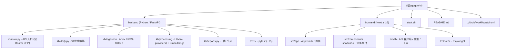

# GPGPU Knowledge Base — 项目级 AI 上下文

> 由 `init-architect`（自适应版）于 `2026-04-25 09:59:45` 自动初始化，
> 于 `2026-04-25 15:26:48` 增量刷新（新增 DeepSeek provider / `/api/chat` Bearer Token / CI 工作流 / Playwright e2e）。
> 本文件为根级文档，给 AI 协作者提供"全局视角"。模块细节请进入对应目录的 `CLAUDE.md`。

---

## 一、项目愿景

**GPGPU Knowledge Base** 是一个面向 GPGPU 芯片架构方向的"自更新研究知识库"。它周期性地收集、总结并打分高影响力的：

- ArXiv 论文（cs.AR / cs.AI / cs.LG / cs.CL / cs.ET / cs.DC / cs.PF / cs.SE / cs.NE）
- 业界与个人技术博客（13 个精选 RSS 源：Semiconductor Engineering、Chips and Cheese、AnandTech、SemiAnalysis、OpenAI、Google AI、Meta AI、HuggingFace、NVIDIA Developer、Lilian Weng、Karpathy、Interconnects 等）
- GitHub 趋势开源项目（围绕 gpu / cuda / triton / mlir / transformer / llm / inference 等关键词）

并对外提供：

1. 语义检索（ChromaDB + sentence-transformers，未安装 ML 依赖时自动降级到关键字检索）
2. 基于检索增强（RAG）的 LLM 对话接口（可选 Bearer Token 保护）
3. 每日自动生成的 Markdown 研究简报
4. 针对论文的 Originality / Impact 双维度（0–10）评分

---

## 二、架构总览

```
                     ┌──────────────────────────────────────┐
                     │  Daily Pipeline (kb.daily)           │
                     │   1) ingest  2) summarize+score      │
                     │   3) embed   4) report               │
                     └──────────────┬───────────────────────┘
                                    │
                                    ▼
        ┌────────────────────────────────────────────────────────┐
        │  SQLite (papers, daily_reports)  +  ChromaDB (vectors) │
        └────────────────────────────────────────────────────────┘
                                    │
                                    ▼
              ┌──────────────────────────────────────────┐
              │  FastAPI (kb.main)                       │
              │  /api/papers  /api/papers/search         │
              │  /api/papers/{id}  /api/chat (🔒 opt)    │
              │  /api/reports[/id]  /api/stats /health   │
              └──────────────────────────────────────────┘
                                    │
                                    ▼
                ┌────────────────────────────────────┐
                │  Next.js 16 (App Router) Frontend  │
                │  Browse / Chat / Paper / Reports / │
                │  Stats — shadcn/ui + Tailwind v4   │
                └────────────────────────────────────┘
```

LLM Provider 抽象在 `backend/kb/processing/llm.py`，可在 `hermes`（默认本地 CLI）/ `anthropic` / `openai` / **`deepseek`** 四者间切换。

---

## 三、模块结构图（Mermaid）



---

## 四、模块索引

| 路径 | 语言 / 框架 | 一句话职责 | 文档 |
| --- | --- | --- | --- |
| `backend/` | Python 3.12 · FastAPI · SQLAlchemy · ChromaDB | 数据采集、LLM 摘要与打分、嵌入索引、REST API、日报生成 | [`backend/CLAUDE.md`](./backend/CLAUDE.md) |
| `frontend/` | Next.js 16 · React 19 · Tailwind v4 · shadcn/ui · Playwright | 浏览 / 搜索 / RAG 聊天 / 论文详情 / 日报 / 统计 UI（含 e2e） | [`frontend/CLAUDE.md`](./frontend/CLAUDE.md) |

> 顶层 `docs/` 目录在仓库中存在但当前内容稀疏，未识别出独立模块。
> `.github/workflows/ci.yml` 提供 backend pytest+coverage / frontend tsc+ESLint / Playwright e2e 三段式 CI。

---

## 五、运行与开发

### 一键启动（本地开发）

```bash
./start.sh
# Backend: http://localhost:8000   (Swagger UI: /docs)
# Frontend: http://localhost:3000
```

### 后端

```bash
cd backend
python -m venv .venv && source .venv/bin/activate
pip install -e .                  # 基础依赖
pip install -e '.[ml]'            # （可选）语义检索 / RAG
pip install -e '.[llm-cloud]'     # （可选）Anthropic / OpenAI / DeepSeek SDK
pip install -e '.[dev]'           # 测试 / lint
mkdir -p data
python -c "from kb.database import init_db; init_db()"
./run_api.sh                      # uvicorn kb.main:app --reload
python -m kb.daily                # 手动跑一遍流水线
python -m pytest tests/ -x -q     # 跑测试（~75 例，<2 秒）
```

### 前端

```bash
cd frontend
npm install
npm run dev    # 默认指向 NEXT_PUBLIC_API_URL || http://localhost:8000
npm run build && npm start
npm run lint
npm run test:e2e   # Playwright（先 `npx playwright install chromium`）
```

### 关键环境变量（前缀 `KB_`，可放 `backend/.env`）

| 变量 | 默认值 | 说明 |
| --- | --- | --- |
| `KB_LLM_PROVIDER` | `hermes` | `hermes` / `anthropic` / `openai` / **`deepseek`** |
| `KB_ANTHROPIC_MODEL` | `claude-sonnet-4-6` | Anthropic 模型 |
| `KB_OPENAI_MODEL` | `gpt-4o-mini` | OpenAI 模型 |
| `KB_DEEPSEEK_MODEL` | `deepseek-chat` | DeepSeek 模型（走 OpenAI 兼容协议） |
| `KB_DEEPSEEK_BASE_URL` | `https://api.deepseek.com` | DeepSeek API 端点 |
| `KB_LLM_TIMEOUT_SECONDS` | `180` | 单次 LLM 超时 |
| `KB_DATABASE_URL` | `sqlite:///./data/kb.sqlite` | SQLAlchemy URL |
| `KB_EMBEDDING_MODEL` | `all-MiniLM-L6-v2` | sentence-transformers 模型 |
| `KB_CHROMA_DIR` | `./data/chroma` | ChromaDB 持久化目录 |
| `KB_ARXIV_PER_CATEGORY` | `50` | ArXiv 单类别拉取上限 |
| `KB_CORS_ORIGINS` | `["http://localhost:3000"]` | 允许的 CORS 来源 |
| `KB_CHAT_QUERY_MAX_LEN` | `2000` | `/api/chat` 与搜索输入最大长度 |
| `KB_CHAT_TOP_K_MAX` | `20` | `/api/chat` `top_k` 上限 |
| **`KB_CHAT_TOKEN`** | – | **若设置，`/api/chat` 必须带 `Authorization: Bearer <token>`，否则 401；未设置则保留无摩擦本地开发** |
| `ANTHROPIC_API_KEY` / `OPENAI_API_KEY` / `DEEPSEEK_API_KEY` / `GITHUB_TOKEN` | – | 也可使用 `KB_` 前缀同名变量 |

---

## 六、测试策略

- **后端**：`backend/tests/`（pytest + pytest-asyncio + httpx），约 **75 个用例，整体覆盖率 ~74%**，详见 `backend/tests/README.md`。
  - `test_api_smoke.py` 已覆盖 `/api/chat` Bearer Token 守卫。
  - `_PROVIDERS` 字典在导入时捕获函数引用，patch 时务必 `patch.dict(llm_mod._PROVIDERS, {...})`。
- **前端**：
  - 静态：`npm run lint`（ESLint 9 flat config + `eslint-config-next`）、`npx tsc --noEmit`。
  - **Playwright e2e**：`tests/e2e/`，`playwright.config.ts` 中 `webServer: npx next start -p 3000`，单 chromium project；后端在 e2e 中**完全 mock**。
- **CI**：`.github/workflows/ci.yml` 三个 job 并行：
  1. `backend-tests`（Python 3.12 + dev extras + pytest-cov）
  2. `frontend-typecheck`（tsc + eslint）
  3. `frontend-e2e`（`npm run build && npm run test:e2e`，`npx playwright install --with-deps chromium`）

---

## 七、编码规范与全局约定

1. **Python**：3.12+；类型注解使用 `X | None` 与 PEP 604 风格；ruff 作为 linter；日志走 `logging.getLogger(__name__)`，**不要** print 业务日志。
2. **TypeScript**：strict mode（`tsconfig` 在 `frontend/` 内），UI 用 shadcn/ui 原语 + Tailwind v4 暗色主题（`bg-zinc-950 text-zinc-100`）。
3. **Next.js 16 注意事项**（来自 `frontend/AGENTS.md`）：**这是最新版 Next.js，API、约定与文件结构相对老版本可能有破坏性变更。在写任何前端代码前，先阅读 `frontend/node_modules/next/dist/docs/` 中的相关文档，并遵从弃用提示。**
4. **Prompt 安全**：所有进入 LLM 的不可信字段必须包裹在 `=== UNTRUSTED START === / END ===` 之间，并通过 `_sanitize()` 限长 + 替换反引号。任何 LLM 调用失败应返回空字符串而不是抛异常（见 `kb.processing.llm.call_llm`）。
5. **数据流不可变性**：ingestion 阶段通过 `url` 唯一索引去重（`Paper.url` 唯一）；processing 阶段以 `is_processed`（0/1/2）作为状态机；ChromaDB 与 SQLite 通过 `Paper.chroma_id` 关联。
6. **API 兼容**：`/api/papers/search` 必须在 `/api/papers/{paper_id}` **之前**注册，否则 FastAPI 会把 `"search"` 当成 paper_id 触发 422（已在代码中以注释说明，新增路由请保持顺序）。
7. **认证 Token 比较**：所有 token / secret 比较使用 `hmac.compare_digest`，禁止 `==`（已在 `verify_chat_token` 中应用）。

---

## 八、AI 使用指引

- 修复后端 bug 或新增端点：先读 `backend/CLAUDE.md`，注意 SQLAlchemy 2.x、Pydantic v2 风格；任何对 `Paper` schema 的更改都需要兼容已有 SQLite（参考 `database.py` 中的 `_BACKCOMPAT_INDEXES`）。
- 修改前端：**必须**先查 `frontend/AGENTS.md` 与 `node_modules/next/dist/docs/`，因为这是 Next 16 + React 19；**不要套用旧版** App Router 经验。
- 涉及 LLM provider / RAG：参见 `backend/kb/processing/llm.py` 的 prompt 注入防护套路；新加 provider 时同时更新 `_PROVIDERS` 字典与 `config.py`。**新增 DeepSeek 时复用了 `openai` SDK 的 `base_url` 参数**——若再扩展 OpenAI 兼容 provider，可借鉴该模式。
- 涉及调度：日常流水线 `python -m kb.daily`，可走 hermes cron（README 中给了示例）。
- **改动 `/api/chat` 时**：保留 `dependencies=[Depends(verify_chat_token)]`；任何新增"对外只允许特定调用者"的端点应复用同一守卫并通过 `KB_*_TOKEN` 配置。

---

## 九、变更记录 (Changelog)

| 时间 | 操作 | 说明 |
| --- | --- | --- |
| 2026-04-25 09:59:45 | 初始化 | 由 `init-architect` 生成根级 + backend + frontend 三份 `CLAUDE.md`，并写入 `.claude/index.json` |
| 2026-04-25 15:26:48 | 增量刷新 | 同步以下变更：① 新增 LLM provider `deepseek`（`config.py` + `llm.py`）；② `/api/chat` 增加可选 Bearer Token 守卫（`KB_CHAT_TOKEN` + `verify_chat_token`，`hmac.compare_digest`）；③ 新增 `.github/workflows/ci.yml`（3 job CI）；④ 新增前端 Playwright e2e（`playwright.config.ts` + `npm run test:e2e` + `@playwright/test` devDep）；⑤ 同步 `backend/tests/README.md` 描述（~75 用例，覆盖率 74%） |
