# GPGPU Knowledge Base — 项目级 AI 上下文

> 由 `init-architect`（自适应版）于 `2026-04-25 09:59:45` 自动初始化，
> 于 `2026-04-25 15:26:48` 增量刷新（DeepSeek provider / `/api/chat` Bearer Token / CI / Playwright e2e），
> 于 `2026-04-25 16:50` 增量刷新（质量门 `is_processed=2` 与 `KB_QUALITY_SCORE_THRESHOLD`），
> 于 `2026-05-02 08:57:04` 增量刷新（Docker Compose 部署 / Next 16 standalone + `/api/*` 反向代理 / Universal Score Axes（quality / relevance）/ 中文模式 `KB_LANGUAGE` / 自适应 ingest 回看窗 / 冷启动批处理 / 非论文 rescore 脚本），
> 于 `2026-05-02 20:12:04` 增量刷新（多轮 Chat 历史 + 单 source 锚定模式 + arxiv PDF 全文加载（`pypdf`，`Paper.full_text` 列）/ 浏览器侧对话历史持久化 / `/chat?paperId=` 深链 / `--timeout-keep-alive 75` 修复 Next 反代 keep-alive 竞态），
> 于 **`2026-05-02 21:18:53`** 增量刷新（**SSE 流式聊天 `/api/chat/stream` + `stream_llm` 抽象 + 前端 `chatStream` async generator + Stop 按钮（`AbortController`）+ 切换会话/卸载/deep-link 自动取消 + chat prompt 改为中文系统消息 + `enterKeyHint="send"`**）。
> 本文件为根级文档，给 AI 协作者提供"全局视角"。模块细节请进入对应目录的 `CLAUDE.md`。

---

## 一、项目愿景

**GPGPU Knowledge Base** 是一个面向 GPGPU 芯片架构方向的"自更新研究知识库"。它周期性地收集、总结并打分高影响力的：

- ArXiv 论文（cs.AR / cs.AI / cs.LG / cs.CL / cs.ET / cs.DC / cs.PF / cs.SE / cs.NE）
- 业界与个人技术博客（11 个精选 RSS 源：Semiconductor Engineering、Chips and Cheese、SemiAnalysis、OpenAI、Google AI、HuggingFace、NVIDIA Developer、NVIDIA Research、Lilian Weng、Karpathy、Interconnects；AnandTech / Meta AI 已下线被移除）
- GitHub 趋势开源项目（围绕 gpu / cuda / triton / mlir / transformer / llm / inference 等关键词）

并对外提供：

1. 语义检索（ChromaDB + sentence-transformers，未安装 ML 依赖时自动降级到关键字检索）
2. 基于检索增强（RAG）的 LLM 对话接口（可选 Bearer Token 保护，**支持多轮历史 + 单 source 锚定模式 + SSE 流式输出**）
3. 每日自动生成的 Markdown 研究简报（中英双语，按 `KB_LANGUAGE` 切换）
4. **多源类型统一评分**：Universal Score Axes — `quality_score` / `relevance_score`（0-10），按 `source_type` 切换语义：
   - `paper` → Originality / Impact（兼容旧字段，自动镜像到 `originality_score` / `impact_score`）
   - `blog` → Depth / Actionability
   - `talk` → Depth / Actionability
   - `project` → Innovation / Maturity

---

## 二、架构总览

```
                     ┌──────────────────────────────────────┐
                     │  Daily Pipeline (kb.daily)           │
                     │   1) ingest  2) summarize+score      │
                     │   3) embed   4) report               │
                     │   (cold-start drains entire backlog) │
                     └──────────────┬───────────────────────┘
                                    │
                                    ▼
        ┌─────────────────────────────────────────────────────────────┐
        │  SQLite (papers, daily_reports)  +  ChromaDB (vectors)      │
        │  papers.is_processed: 0=pending / 1=active / 2=skipped      │
        │  papers.full_text: lazy-cached PDF body for source-anchored │
        └─────────────────────────────────────────────────────────────┘
                                    │
                                    ▼
              ┌───────────────────────────────────────────────────────┐
              │  FastAPI (kb.main)                                    │
              │  /api/papers  /api/papers/search  /api/papers/{id}    │
              │  /api/chat         (🔒 opt; paper_id + history)       │
              │  /api/chat/stream  (🔒 opt; SSE: sources/token/done)  │
              │  /api/reports[/id]  /api/stats /health                │
              └───────────────────────────────────────────────────────┘
                                    │
                                    ▼
                ┌───────────────────────────────────────────────────┐
                │  Next.js 16 (standalone)                          │
                │  /api/* → Next 反向代理 → backend (no CORS)        │
                │  Browse / Chat (multi-turn + Source pin sidebar   │
                │  + SSE streaming + Stop button + AbortController  │
                │  + localStorage 历史 + /chat?paperId= 深链) /     │
                │  Paper / Reports / Stats — shadcn/ui + Tailwind v4│
                └───────────────────────────────────────────────────┘
                                    │
                                    ▼
                ┌────────────────────────────────────┐
                │  Docker Compose (backend+frontend) │
                │  + opt-in `daily` profile (cron)   │
                │  Volumes: ./backend/data → /app/data│
                └────────────────────────────────────┘
```

LLM Provider 抽象在 `backend/kb/processing/llm.py`，可在 `hermes`（默认本地 CLI，**容器中不可用**）/ `anthropic` / `openai` / `deepseek` 四者间切换。
**两套对外入口**：`call_llm`（一次性返回完整文本，给 `/api/chat` 与 summarization/scoring）+ `stream_llm`（增量 yield 文本片段，给 `/api/chat/stream`）；hermes 因子进程不能真正流式，被实现为"一次性返回，单 chunk yield"以保 API 契约对称。
PDF 全文抽取在 `backend/kb/processing/pdf.py`（`pypdf` 默认依赖；**20 MB / 30 s 上限 + 12 万字符截断**），结果缓存在 `Paper.full_text`，仅在 `/api/chat` 或 `/api/chat/stream` 进入 `paper_id` 锚定模式时按需触发。

---

## 三、模块结构图（Mermaid）

```mermaid
graph TD
    A["(根) gpgpu-kb"] --> B["backend (Python / FastAPI)"]
    A --> C["frontend (Next.js 16 standalone)"]
    A --> D["start.sh · 本地一键启动"]
    A --> E["docker-compose.yml · 容器化部署"]
    A --> F["README.md"]
    A --> G[".github/workflows/ci.yml"]
    A --> H[".env.docker.example"]
    A --> I[".omc/plans/ · autopilot/ralph 计划记录"]

    B --> B1["kb/main.py · API 入口 (含 Bearer 守卫 + chat/chat-stream 双端点)"]
    B --> B2["kb/daily.py · 流水线编排 (冷启动检测)"]
    B --> B3["kb/ingestion · ArXiv / RSS / GitHub + 自适应 days_back"]
    B --> B4["kb/processing · LLM (4 providers, call_llm + stream_llm) + Embeddings + PDF 全文"]
    B --> B5["kb/reports.py · 日报 (按 max(quality,relevance) 排序)"]
    B --> B6["kb/scripts/ · 一次性运维脚本 (rescore_non_papers)"]
    B --> B7["tests/ · pytest (~115)"]
    B --> B8["Dockerfile + .dockerignore + run_api.sh (--timeout-keep-alive 75)"]

    C --> C1["src/app · App Router 页面"]
    C --> C2["src/components · shadcn/ui + chat sidebar/source-picker"]
    C --> C3["src/hooks/use-conversation-history.ts · localStorage 持久化"]
    C --> C4["src/lib · API 客户端 (含 chatStream SSE generator) / 类型 (含 ChatStreamEvent) / 工具"]
    C --> C5["next.config.ts · standalone + /api 反代"]
    C --> C6["tests/e2e · Playwright"]
    C --> C7["Dockerfile (multi-stage)"]

    click B "./backend/CLAUDE.md" "查看 backend 模块文档"
    click C "./frontend/CLAUDE.md" "查看 frontend 模块文档"
```



---

## 四、模块索引

| 路径 | 语言 / 框架 | 一句话职责 | 文档 |
| --- | --- | --- | --- |
| `backend/` | Python 3.12 · FastAPI · SQLAlchemy 2 · ChromaDB · pypdf | 数据采集、LLM 摘要 + 双维度评分、嵌入索引、REST API（含多轮 RAG、source-anchored chat 与 **SSE 流式**）、日报、运维脚本 | [`backend/CLAUDE.md`](./backend/CLAUDE.md) |
| `frontend/` | Next.js 16 · React 19 · Tailwind v4 · shadcn/ui · Playwright | 浏览 / 搜索 / **流式多轮 RAG 聊天（带历史侧栏 + Source pin + Stop 按钮 + 深链）** / 详情 / 日报 / 统计 UI；通过 Next 反代 `/api/*` 到后端 | [`frontend/CLAUDE.md`](./frontend/CLAUDE.md) |

> 顶层 `docs/` 目录存在但内容稀疏，未识别为独立模块。
> 顶层 `docker-compose.yml` / `.env.docker.example` 提供 backend + frontend + 可选 `daily` 三服务部署栈（详见根 README "Docker Deployment"）。
> `.github/workflows/ci.yml` 提供 backend pytest+coverage / frontend tsc+ESLint / Playwright e2e 三段式 CI。
> `.omc/plans/autopilot-chat-enhance.md` 记录了上一轮（多轮 + source 锚定 + PDF 全文）的实施计划；本轮（SSE 流式）未单独立 plan，直接在 `kb/processing/llm.py` 与 `kb/main.py` 内实现。

---

## 五、运行与开发

### 一键启动（本地开发）

```bash
./start.sh
# Backend: http://localhost:8000   (Swagger UI: /docs)
# Frontend: http://localhost:3000
```

### Docker 部署（推荐用于自托管 / cpolar）

```bash
cp .env.docker.example .env
# 编辑 .env：至少设置 KB_LLM_PROVIDER + 对应 API key
docker compose up -d --build
# 一次性流水线：
docker compose --profile cron run --rm daily
```

> 数据持久化：`./backend/data` bind-mount 到容器内 `/app/data`；备份直接拷贝该目录或用 `tar` 即可。
> 注意：`hermes` provider 在容器内不可用，必须选 `openai` / `anthropic` / `deepseek`。
> Backend 容器与本机 `run_api.sh` 都已加 `--timeout-keep-alive 75`，避免 uvicorn 默认 5 s keep-alive 与 Next 反代连接池产生 ECONNRESET 竞态（症状：聊天页随机 "Sorry, I couldn't process that query"）。**SSE 流式响应天然依赖长 keep-alive**，对 `/api/chat/stream` 同样必要。

### 后端

```bash
cd backend
python -m venv .venv && source .venv/bin/activate
pip install -e .                  # 基础依赖（含 pypdf）
pip install -e '.[ml]'            # （可选）语义检索 / RAG（ChromaDB + sentence-transformers，~2GB）
pip install -e '.[llm-cloud]'     # （可选）Anthropic / OpenAI / DeepSeek SDK
pip install -e '.[dev]'           # 测试 / lint
mkdir -p data
python -c "from kb.database import init_db; init_db()"
./run_api.sh                      # uvicorn kb.main:app --reload --timeout-keep-alive 75
python -m kb.daily                # 手动跑一遍流水线
python -m kb.daily --lang zh      # 中文输出（覆盖 KB_LANGUAGE）
python -m kb.scripts.rescore_non_papers --dry-run  # 回填非论文行的 universal scores
python -m pytest tests/ -x -q     # 跑测试（~115 例，<2 秒）
```

### 前端

```bash
cd frontend
npm install
npm run dev    # 默认调用同源 /api/*（被 next.config.ts 反代到 backend）
npm run build && npm start         # next start (standalone)
npm run lint
npm run test:e2e   # Playwright（先 `npx playwright install chromium`）
```

### 关键环境变量（前缀 `KB_`，可放 `backend/.env` 或 `.env`）

| 变量 | 默认值 | 说明 |
| --- | --- | --- |
| `KB_LLM_PROVIDER` | `hermes` | `hermes` / `anthropic` / `openai` / `deepseek`（容器中必须选后三个）。**hermes 不能真正流式**，`/api/chat/stream` 在 hermes 下走单 chunk fallback |
| `KB_ANTHROPIC_MODEL` | `claude-sonnet-4-6` | Anthropic 模型 |
| `KB_OPENAI_MODEL` | `gpt-4o-mini` | OpenAI 模型 |
| `KB_DEEPSEEK_MODEL` | `deepseek-chat` | DeepSeek 模型（OpenAI 兼容协议） |
| `KB_DEEPSEEK_BASE_URL` | `https://api.deepseek.com` | DeepSeek API 端点 |
| `KB_LLM_TIMEOUT_SECONDS` | `180` | 单次 LLM 超时（同时透传给 stream provider 的 `timeout=`） |
| `KB_DATABASE_URL` | `sqlite:///./data/kb.sqlite` | SQLAlchemy URL；Docker 内默认 `sqlite:////app/data/kb.sqlite` |
| `KB_EMBEDDING_MODEL` | `all-MiniLM-L6-v2` | sentence-transformers 模型 |
| `KB_CHROMA_DIR` | `./data/chroma` | ChromaDB 持久化目录 |
| `KB_DATA_DIR` | `./data` | 数据根目录（Docker 中是 `/app/data`） |
| `KB_ARXIV_PER_CATEGORY` | `50` | ArXiv 单类别拉取上限 |
| `KB_INGEST_EMPTY_DB_DAYS` | `30` | 空库冷启动回看天数 |
| `KB_INGEST_GAP_MIN_DAYS` | `1` | 自适应回看窗下限 |
| `KB_INGEST_GAP_MAX_DAYS` | `30` | 自适应回看窗上限（防止长闲置时多月重摄入） |
| `KB_QUALITY_SCORE_THRESHOLD` | `7.0` | 质量门：`max(quality, relevance) < 阈值 → is_processed=2`（仅对 `paper` 生效） |
| `KB_LANGUAGE` | `en` | LLM 输出语言：`en` / `zh`（影响摘要、评分理由、日报）。**注意**：本轮起 `/api/chat` 与 `/api/chat/stream` 的系统 prompt 已**硬编码为中文**，不再受 `KB_LANGUAGE` 影响 |
| `KB_CORS_ORIGINS` | `["http://localhost:3000"]` | 允许的 CORS 来源（Docker 中 compose 自动追加 127.0.0.1） |
| `KB_CHAT_QUERY_MAX_LEN` | `2000` | `/api/chat` 与搜索输入最大长度（`ChatMessage.content` 上限是 4×该值） |
| `KB_CHAT_TOP_K_MAX` | `20` | `/api/chat` `top_k` 上限 |
| `KB_CHAT_TOKEN` | – | 若设置，`/api/chat` **与** `/api/chat/stream` 必须带 `Authorization: Bearer <token>`，否则 401 |
| `KB_BACKEND_URL` | `http://127.0.0.1:8000` | 前端 Next 反代目标（`next.config.ts`）；Docker 中是 `http://backend:8000`，需在 build 时传入 |
| `NEXT_PUBLIC_API_URL` | `""` | 浏览器直连 API 时使用；空串则走 Next 反代（推荐） |
| `BACKEND_INSTALL_EXTRAS` | `ml,llm-cloud` | 镜像构建参数：留空可去掉 ML 栈（~2GB） |
| `ANTHROPIC_API_KEY` / `OPENAI_API_KEY` / `DEEPSEEK_API_KEY` / `GITHUB_TOKEN` | – | 也可用 `KB_` 前缀同名变量 |

---

## 六、测试策略

- **后端**：`backend/tests/`（pytest + pytest-asyncio + httpx），约 **~115 个用例，<2 秒，无网络**，详见 `backend/tests/README.md`。本轮新增覆盖：
  - `test_api_smoke.py` — 新增 `_drain_sse` 辅助 + 5 例 SSE 场景：① happy path（事件顺序 `sources → token... → done`，`sources` 仅含目标 paper，token 累计 = 完整输出）；② history 注入到 stream prompt；③ `paper_id` 不存在 → **流开始前**返回 HTTP 404 而非空流；④ provider 空输出 → 占位 `(LLM produced no output)` token；⑤ `system` role 在 stream 端点同样 422。
  - `test_processing_llm.py` — 新增 5 例 `stream_llm`：① 路由到 `_STREAM_PROVIDERS[provider]`；② provider mid-stream 异常被静默吞掉，已 yield 的 chunk 保留；③ `anthropic` 路由；④ `_stream_hermes` 单 chunk fallback；⑤ `_call_hermes` 返空时 `_stream_hermes` 不 yield 空串。
  - 既有的 chat / 评分 / PDF / 报告 / ingestion 测试不变（详见 `backend/CLAUDE.md` "测试与质量"章节）。
  - `_PROVIDERS` / `_STREAM_PROVIDERS` 字典在导入时捕获函数引用，patch 时务必 `monkeypatch.setitem(llm_mod._PROVIDERS, "hermes", mock)` / `monkeypatch.setitem(llm_mod._STREAM_PROVIDERS, "hermes", mock)`。
- **前端**：
  - 静态：`npm run lint`（ESLint 9 flat config + `eslint-config-next`）、`npx tsc --noEmit`。
  - **Playwright e2e**：`tests/e2e/`，`playwright.config.ts` 中 `webServer: npx next start -p 3000`，单 chromium project；后端在 e2e 中**完全 mock**。建议补 SSE 路径的用例（mock `text/event-stream` 响应、Stop 按钮 abort、切换会话期间 abort）。
- **CI**：`.github/workflows/ci.yml` 三个 job 并行：
  1. `backend-tests`（Python 3.12 + dev extras + pytest-cov，`KB_LLM_PROVIDER=hermes` + 测试 mock）
  2. `frontend-typecheck`（tsc + eslint）
  3. `frontend-e2e`（`npm run build && npm run test:e2e`，`npx playwright install --with-deps chromium`）

---

## 七、编码规范与全局约定

1. **Python**：3.12+；类型注解使用 `X | None` 与 PEP 604 风格；ruff 作为 linter；日志走 `logging.getLogger(__name__)`，**不要** print 业务日志（流水线启动横幅例外）。
2. **TypeScript**：strict mode（`tsconfig` 在 `frontend/` 内），UI 用 shadcn/ui 原语 + Tailwind v4 暗色主题（`bg-zinc-950 text-zinc-100`）。
3. **Next.js 16 注意事项**（来自 `frontend/AGENTS.md`）：**这是最新版 Next.js，API、约定与文件结构相对老版本可能有破坏性变更。在写任何前端代码前，先阅读 `frontend/node_modules/next/dist/docs/` 中的相关文档，并遵从弃用提示。**
4. **Prompt 安全**：所有进入 LLM 的不可信字段必须包裹在 `=== UNTRUSTED START === / END ===` 之间，并通过 `_sanitize()` 限长 + 替换反引号。任何 LLM 调用失败应返回空字符串 / 静默结束 generator 而不是抛异常（见 `kb.processing.llm.call_llm` 与 `stream_llm`）。**JSON 评分键名必须英文**（`quality_score` / `relevance_score` / `score_rationale`），中文模式只翻译 `score_rationale` 的值。**多轮 chat 历史 `history[]` 也包在同一个 UNTRUSTED 块中**（见 `_format_history`，最多保留 12 条最近 turn，每条额外 4000 字符 cap）。本轮 `/api/chat` 与 `/api/chat/stream` 共享 `_build_chat_context()`，prompt 模板已改为中文（`你是一名资深的 GPGPU 芯片架构助理 ...`），任何 prompt 修改都要在该函数里**一处改两处生效**。
5. **数据流不可变性**：ingestion 阶段通过 `url` 唯一索引去重；processing 阶段以 `is_processed`（0/1/2）作为状态机；ChromaDB 与 SQLite 通过 `Paper.chroma_id` 关联；ChromaDB 仅索引 `is_processed=1` 的行。`Paper.full_text` 仅在 source-anchored chat 第一次成功提取后才写入，**网络/解析失败保持空串**避免污染缓存。
6. **API 路由顺序**：`/api/papers/search` 必须在 `/api/papers/{paper_id}` **之前**注册，否则 FastAPI 把 `"search"` 当成 `paper_id` 触发 422（已在代码中以注释说明）。
7. **认证 Token 比较**：所有 token / secret 比较使用 `hmac.compare_digest`，禁止 `==`。**`/api/chat` 与 `/api/chat/stream` 都挂 `dependencies=[Depends(verify_chat_token)]`**——新增任何 chat 端点必须复用同款守卫。
8. **Universal Score Axes**：所有新代码读分数请优先用 `paper.quality_score` / `paper.relevance_score`；`originality_score` / `impact_score` 仅作为 paper 类型的 legacy 镜像字段保留以兼容旧 daily report 与外部 API。前端 `paper-card.tsx` / 详情页通过 `_resolveScores` 做 fallback：`quality_score || originality_score`。
9. **冷启动批处理**：`kb.daily` 启动时会探测是否首次运行（`is_processed != 0` 全为空），是则去掉 100 条/run 的处理与索引上限，避免后到的 RSS / GitHub 项目被 ArXiv 队列前缀饿死。
10. **数据库迁移**：SQLite 不支持自动加列/索引；新增列时同步在 `database.py` 的 `_BACKCOMPAT_COLUMNS`（已含 `quality_score / relevance_score / score_rationale / full_text`）与 `_BACKCOMPAT_INDEXES` 注册，`init_db()` 会幂等 `ALTER TABLE` / `CREATE INDEX IF NOT EXISTS`。
11. **多轮 chat 持久化（前端）**：`useConversationHistory` 把对话写入 `localStorage["gpgpu-kb.chat.conversations.v1"]`（最多 50 条 conversation，按 `updatedAt` 倒排）。SSR 期间永远渲染空数组，hydration 完成后才填充——避免 SSR/CSR markup mismatch。**任何新增 chat 状态字段都要同步进 `Conversation` 接口与 `_isConversation` 守卫**，否则旧 localStorage 数据会被静默丢弃。本轮新增的 `streaming` / `error` 仅是 UI 层 transient 字段，**通过 `_stripDisplay` 在持久化前过滤掉，不进 localStorage 也不发回 backend**。
12. **ChatMessage 角色白名单**：后端 `ChatMessage.role` 用 `pattern="^(user|assistant)$"`，**禁止 system**。前端不要添加 system role；后端的指令永远在 `_build_chat_context()` 函数本地拼接。
13. **SSE 契约（本轮新增，见 `kb/main.py::chat_stream`）**：每条事件帧形如 `event: <name>\ndata: <json>\n\n`；事件序列固定为 `sources`（恰 1 条）→ `token`（≥1 条；若 `stream_llm` 无任何输出则发占位 `(LLM produced no output)`）→ `done`（恰 1 条终止符）。可选 `error`（当前实现里 stream provider 失败是静默吞掉，不会发 `error`，前端通过 `done` 之前 token 累计是否为空区分）。Header 必须含 `X-Accel-Buffering: no` + `Cache-Control: no-cache`，否则 nginx / cpolar 会缓冲掉流式效果。**HTTPException（如 paper_id 404）必须在 `event_stream()` 之外抛**——`_build_chat_context` 同步先跑就是为了让 404 走正常 HTTP 错误，而不是被裹进一个已经 200 的 streaming 响应里。
14. **Streaming provider 抽象（本轮新增，见 `kb/processing/llm.py`）**：`_STREAM_PROVIDERS` 与 `_PROVIDERS` 平行；新增 provider 时**两侧都要加**。`hermes`（subprocess）不能真正流式，`_stream_hermes` 实现为"调 `_call_hermes` 一次性拿全文 → yield 单 chunk（空字符串则不 yield）"。`openai` / `deepseek` 共用 `_stream_openai_compatible(api_key, model, base_url=None)`——新增其它 OpenAI 兼容 provider 时直接复用。

---

## 八、AI 使用指引

- 修复后端 bug 或新增端点：先读 `backend/CLAUDE.md`，注意 SQLAlchemy 2.x、Pydantic v2 风格；任何对 `Paper` schema 的更改都需要兼容已有 SQLite（参考 `database.py` 中的 `_BACKCOMPAT_*`）。
- 修改前端：**必须**先查 `frontend/AGENTS.md` 与 `node_modules/next/dist/docs/`，因为这是 Next 16 + React 19；**不要套用旧版** App Router 经验。
- 涉及 LLM provider / RAG：参见 `backend/kb/processing/llm.py` 的 prompt 注入防护套路与 `_lang_instruction` / `_impact_lang_instruction`；新加 provider 时同时更新 `_PROVIDERS` / `_STREAM_PROVIDERS` 字典与 `config.py`。**OpenAI 兼容 provider 直接复用 `_stream_openai_compatible(api_key, model, base_url)`**。
- 涉及调度：日常流水线 `python -m kb.daily`（本地）或 `docker compose --profile cron run --rm daily`（容器）。
- **改动 `/api/chat` 或 `/api/chat/stream` 时**：① 都保留 `dependencies=[Depends(verify_chat_token)]`；② prompt 与 source / history 拼装走共享的 `_build_chat_context(req, db)`，不要让两个端点自己拷贝模板；③ stream 端点必须先在 `event_stream()` 之外把 `_build_chat_context` 跑掉，让 HTTPException（如 404）走标准 HTTP 错误而不是空 SSE；④ stream 端点的响应头必须含 `X-Accel-Buffering: no` 与 `Cache-Control: no-cache`，否则 nginx / cpolar 会缓冲掉流式效果。**不要在 `paper_id` 模式下做 RAG 检索**（已显式 `if req.paper_id is not None: ... return`）。
- **改动评分**：注意 `summarize_and_score` 已经按 `source_type` 分桶 rubric；不要在 paper rubric 上加 blog/project 才有的字段，反之亦然。
- **改前端 score 显示**：同步更新 `paper-card.tsx` 与 `paper/[id]/page.tsx` 两处 `SCORE_LABELS`（与 `backend/kb/reports.py::_SCORE_LABELS` 三处保持镜像一致）。
- **新增 Docker 镜像构建参数**：注意 `NEXT_PUBLIC_*` 是 build-time baked，运行时改 env 无效；前端要么 rebuild，要么走 Next 反代（默认）。
- **改 chat 多轮 / 流式逻辑**：前后端两侧都要同步 — `frontend/src/lib/types.ts::ChatMessage` / `ChatRequest` / `ChatStreamEvent`、`frontend/src/lib/api.ts::_chatPayload` + `chat()` + `chatStream()` + `_parseSSEFrame`、`backend/kb/schemas.py::ChatMessage`/`ChatRequest`、`backend/kb/main.py::_format_history` + `_build_chat_context` + `chat_stream::event_stream` + `_sse_event`。`history[]` 容量上限 (Pydantic `max_length=40`) 与 prompt 内最近 turn 数 (`_HISTORY_TURN_CAP=12`) 是两个独立旋钮：前者防 DoS，后者控 token 预算。
- **新增 PDF 来源**：`fetch_full_text` 用 `_looks_like_pdf_url` 判断是 PDF 还是 abstract fallback；新加白名单 substring 时确保不要把 HTML 页面误判为 PDF（pypdf 解析 HTML 会输出乱码并被缓存）。
- **新增 SSE 事件类型**：在 `kb/main.py::chat_stream::event_stream` 内 `_sse_event(<name>, <payload>)` 即可；同步把 union 加到前端 `ChatStreamEvent`，并在 `api.ts::_parseSSEFrame` 加 `if (event === "...")` 解码分支。前端聊天页 `chat/page.tsx::handleSend` 的 `for await` 循环目前只识别 `sources / token / error / done` 四种，新增类型记得加 case。
- **改前端流式 / abort 逻辑**：`abortRef` 是 chat 页的"全局正在进行中的流"句柄。**任何"语义上让旧流应被抛弃"的事件**（Stop 按钮 / 切换历史会话 / 新建会话 / `?paperId=` 深链触发的新会话 / 组件卸载）都必须先 `abortRef.current?.abort()`，否则旧流的 token 会继续灌进新会话的 placeholder。`finally` 内只在 `abortRef.current === controller` 时清空，避免覆盖已被新 send 替换的 controller。

---

## 九、变更记录 (Changelog)

| 时间 | 操作 | 说明 |
| --- | --- | --- |
| 2026-04-25 09:59:45 | 初始化 | 由 `init-architect` 生成根级 + backend + frontend 三份 `CLAUDE.md`，并写入 `.claude/index.json` |
| 2026-04-25 15:26:48 | 增量刷新 | 同步以下变更：① 新增 LLM provider `deepseek`；② `/api/chat` 增加可选 Bearer Token 守卫（`KB_CHAT_TOKEN` + `verify_chat_token`，`hmac.compare_digest`）；③ 新增 `.github/workflows/ci.yml`；④ 新增前端 Playwright e2e |
| 2026-04-25 16:50 | 质量门 | 新增 `KB_QUALITY_SCORE_THRESHOLD`（默认 7.0），`/api/papers` 默认仅返 `is_processed=1`，加 `?include_low_quality=true` 旁路；`/api/stats` 拆 `processed` / `skipped_low_quality` / `pending` 三档 |
| 2026-05-02 08:57:04 | 增量刷新 | ① **Universal Score Axes**（paper/blog/talk/project rubrics + paper legacy 镜像）；② **中文模式 `KB_LANGUAGE=zh`**；③ **Docker Compose 部署栈** + 双侧 Dockerfile + .dockerignore；④ **Next 反代 `/api/*`** + standalone build；⑤ **自适应 ingest 回看窗** (`_compute_days_back`)；⑥ **冷启动批处理**；⑦ **运维脚本 `rescore_non_papers.py`**；⑧ **RSS 源精简到 11 个**；⑨ **CORS 处理改造**（同源走 Next 反代，不再放宽 CORS）。详见 `.claude/index.json` 的同名 changelog 条目正文。 |
| 2026-05-02 20:12:04 | 增量刷新 | ① **多轮 Chat 历史**：`schemas.py` 新增 `ChatMessage{role,content}` 与 `ChatRequest.history: list[ChatMessage]`（`max_length=40`，单条 `max_length = chat_query_max_len * 4`，`role` 锁 `^(user\|assistant)$`，**禁止 system**）；`main.py::_format_history` 把最近 12 条 turn 渲染进 UNTRUSTED 块。② **单 source 锚定模式**：`ChatRequest.paper_id`，`/api/chat` 检测到该字段时跳过 RAG 检索，按 ID 取 `Paper`，调用 `kb.processing.pdf.fetch_full_text(paper_id)` 拉到全文（截断至 60 000 字符）放入 prompt；`paper_id` 不存在 → 404。③ **PDF 全文加载与缓存**：新模块 `kb/processing/pdf.py`，`pypdf` 默认依赖；20 MB / 30 s 上限 + 12 万字符截断；`Paper.full_text` 列加入 `_BACKCOMPAT_COLUMNS`。④ **前端 chat 重构**（双栏 + 历史侧栏 + Source 锚定 + `/chat?paperId=` 深链 + 移动端响应式）。⑤ **uvicorn `--timeout-keep-alive 75`** 修复 Next 反代 ECONNRESET 竞态。⑥ 测试套件 ~95 → ~105。⑦ `.omc/plans/autopilot-chat-enhance.md` 设计文档。 |
| **2026-05-02 21:18:53** | **增量刷新** | ① **`/api/chat/stream` SSE 端点（新）**（`backend/kb/main.py`）：响应 `text/event-stream`，事件序列固定 `sources → token... → done`，可携带 `error`；token 流空时发占位 `(LLM produced no output)`；header 含 `X-Accel-Buffering: no` + `Cache-Control: no-cache`。**复用 `verify_chat_token` Bearer 守卫**。`paper_id` / `history` 与非流式 `/api/chat` 行为完全一致——通过新抽出的 **`_build_chat_context(req, db)`** 共享 prompt + sources 构造逻辑；HTTPException（如 paper_id 404）在流开始前抛出，让客户端看到正常 HTTP 错误而非空流。新增 `_sse_event(event, data)` helper（`json.dumps(..., ensure_ascii=False)` 保中文紧凑）。② **`stream_llm` 抽象（新）**（`backend/kb/processing/llm.py`）：与 `call_llm` 平行的公开 API，从 `_STREAM_PROVIDERS` 字典路由；任何 provider 失败静默 `return`（generator 结束，从不 raise，对齐 `call_llm` 的空字符串契约）。`_stream_anthropic` 走 `client.messages.stream(...).text_stream`；`_stream_openai_compatible(api_key, model, base_url=None)` 公共体被 `_stream_openai` 与 `_stream_deepseek` 复用。`_stream_hermes` 因子进程不能真正流式，实现为"调 `_call_hermes` 拿全文 → yield 单 chunk（空字符串则不 yield）"。③ **Chat prompt 改为中文系统消息**（`_build_chat_context`）：从英文 `You are an expert GPGPU chip architect ...` 改成 `你是一名资深的 GPGPU 芯片架构助理 ...`，结尾要求"请用简体中文作答"。**这意味着 `KB_LANGUAGE` 不再影响 chat prompt（仅影响 summarization / scoring / reports）**；如要回退英文需直接改模板。④ **前端 `chatStream()` async generator（新）**（`frontend/src/lib/api.ts`）：fetch `/api/chat/stream` → `response.body.getReader()` → `TextDecoder` 累积 → 按 `\n\n` 分帧 → `_parseSSEFrame` 解码为 `ChatStreamEvent` discriminated union。`finally` 内 `reader.releaseLock()` 包 try/catch（abort 后释放会 throw）。`_chatPayload(request)` 抽出供 `chat()` 与 `chatStream()` 共用，依然清理 `undefined` / `null`。`Accept: text/event-stream` 头被显式发送。⑤ **`ChatStreamEvent` discriminated union**（`frontend/src/lib/types.ts`）：`{type:"sources",sources}` / `{type:"token",content}` / `{type:"error",message}` / `{type:"done"}`，与后端 `_sse_event` 镜像。⑥ **聊天页完全重写为流式**（`frontend/src/app/chat/page.tsx`）：`DisplayMessage` 新增 `streaming?: boolean` transient 字段，发送时立即 push 一条空的 streaming placeholder，`for await (const ev of chatStream(...))` 增量把 `accumulated` 字符串往 placeholder 里灌（用 `snapshot` 局部变量避免闭包过期）；`AbortController` 由 `abortRef` 持有，**Stop 按钮 / 切换会话 / 新建会话 / `?paperId=` deep-link 切换 / 组件卸载**全都触发 `abortRef.current?.abort()`；持久化路径用 send-start 时拍下的 `priorTurns` 快照而非闭包里的 `messages`，防止用户中途切换会话时把当前流的 turn 漏写到新会话里。新增 `Stop` 按钮（红色 `Square` 图标）替换 `Send` 在 loading 状态下显示；`Input` 加 `enterKeyHint="send"` 改善移动端键盘 UX；spinner 仅在"streaming 但 placeholder 还空"时显示，token 一开始流就让 markdown 渲染接管。错误三态 finalize：`showError`（持久化跳过 + 红色气泡）/ `aborted`（保留部分内容 + 持久化）/ `done`（正常持久化）。⑦ **测试**：`backend/tests/test_api_smoke.py` 加 5 例 SSE（`_drain_sse` 辅助 + happy path 事件序列校验 + history 注入 + 404 在流开始前抛 + 空输出占位 + system role 422）；`backend/tests/test_processing_llm.py` 加 5 例 streaming（路由 / 异常静默吞掉但保留已 yield chunk / anthropic 路由 / hermes fallback / hermes 空时不 yield）。套件总数 ~105 → ~115。⑧ **`backend/Dockerfile` / `backend/run_api.sh`** 内容相对上轮无变化（`--timeout-keep-alive 75` 已在位），但本轮 SSE 长连接对其依赖性更强，已在 Dockerfile 注释里明确指出 ECONNRESET 竞态背景。所有 delta 已通过直接读取 `backend/kb/main.py` / `kb/processing/llm.py` / `tests/test_api_smoke.py` / `tests/test_processing_llm.py` / `frontend/src/app/chat/page.tsx` / `frontend/src/lib/api.ts` / `frontend/src/lib/types.ts` 源码核对。 |
